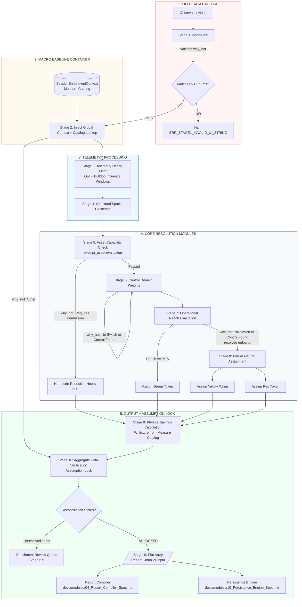

# Deepwalk Inference Engine

An isolated, deterministic backend repository that ingests raw field observations and outputs validated energy findings, domain scores, and savings metrics, completely decoupled from the Discovery Studio frontend interface.

**Architecture reference:** See `docs/SYSTEM_ARCHITECTURE_MASTER.md` for tier definitions, document index, and cross-reference rules.

---

## Repository Structure

```
Inference-Engine/
├── README.md
├── docs/
│   ├── SYSTEM_ARCHITECTURE_MASTER.md      # Library index and tier governance
│   ├── 01_Discovery_Studio_Config_Spec.md # Canonical ObservationNode schema
│   ├── 06_Spatial_Model_Spec.md           # space_id, sticky map, forensic timestamp
│   ├── 05_API_Contracts.md                # API endpoint architecture (draft)
│   ├── architecture/
│   │   └── inference-engine-spec.md       # Full pipeline stage spec (v3.1 production)
│   ├── decisions/
│   │   └── DECISIONS_REGISTER.md          # Architectural decisions register (Tier 1)
│   ├── modules/
│   │   ├── 03_Measure_Catalog_Spec.md     # equipment_class taxonomy; wattage fallback hierarchy
│   │   ├── 04_Report_Compiler_Spec.md     # Report section spec; Performance Map; finding cards
│   │   ├── 10_Persistence_Engine_Spec.md  # PE product definition; status model; dashboard
│   │   └── Implementation_Support_Spec_v1.1.md  # Checklist; SOPs; customer system mapping
│   └── reference/
│       ├── Opportunity_Signature_Library.md          # 8 recurring operational condition patterns
│       ├── Observability_Scope_Boundary_Framework.md # Observability limits; exempt_asset; exception codes
│       └── Operational_Load_Taxonomy.md              # 5 operational load categories; evidence classification
```

---

## Pipeline Overview

The Inference Engine processes field observations through 10 sequential stages, from normalization through savings calculation, producing a locked flat array consumed by the Report Compiler.



---

## Key V4 Terminology

| Use this | Not this |
|----------|----------|
| `exempt_asset` | `necessary_baseload` |
| `did_you_turn_it_off` | `did_you_turn_off` |
| `fixture_count` | `field_count` |
| `observation_type` | `asset_sub_class`, `Measure Type`, `Measure Category` |
| `space_id` | `room_id`, `space_function` |
| `field_state_enum` | `state` |
| `why_not` | `why_not_enum` |
| `"No Switch or Control Found"` | `"No Switch Present"`, `"Control Not Found"` |
| Green / Yellow / Red | Immediate / Coordination / Capital |
| Engineering Track | Programmatic Tier |

**Retired from V1 (do not implement):**
- `"Timer / Schedule"` why_not value — reserved for V2
- Guarantee Savings Pool, Added Value Pool, Documented Baseline Pool
- Distribution Handoff Matrix

---

## Documents Requiring Harmonization

The following files in this repository contain outdated terminology and are scheduled for update:

| File | Issue |
|------|-------|
| `docs/architecture/inference-engine-spec.md` Section 6.1 | Uses retired field names: `did_you_turn_off`, `field_count`, `asset_sub_class` |

---

*Deep//Walk by Third Switch — Assurance at Scale*
*© 2026 Third Switch, LLC. Internal reference. Not for external distribution without review.*
