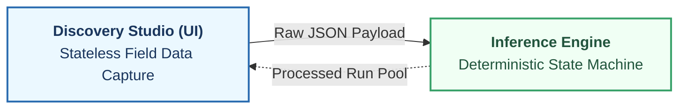
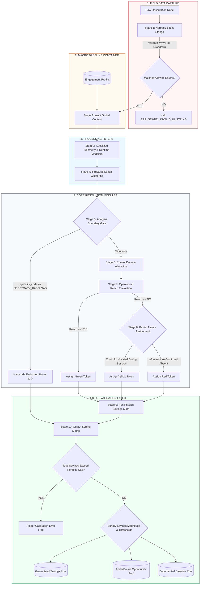

# Inference Engine Technical Specification

## SECTION 1 — Executive System Overview

### 1.1 — Functional Role
The Inference Engine is the deterministic, server-side processing core responsible for transforming raw environmental observations into verified, audit-ready energy optimization measures. It serves as the single source of truth for calculations, risk token attribution, and portfolio financial modeling.

### 1.2 — System Decoupling (Frontend vs. Backend Contract)
To maintain structural agility and prevent logic fragmentation, the system enforces a strict architectural boundary between data acquisition and data processing:

* **The Discovery Studio (Frontend):** The mobile and web wireframes function purely as stateless capture mechanisms. The frontend UI is completely blind to savings math, asset wattages, utility structures, or routing topology. Its sole responsibility is to capture field states, validate user inputs against basic data types, and ship flat data structures.
* **The Inference Engine (Backend):** The engine functions as an isolated, deterministic state machine. It consumes the raw payload, injects global constraints, runs the physics modeling loops, and distributes results.


### 1.3 — Operational Boundaries
The engine does not utilize machine learning, predictive heuristics, or stochastic estimation. Every output state is a direct, traceable function of its inputs and fixed engineering constants. If the engine encounters an incomplete data state that cannot be resolved through predefined fallback rules, it is structurally mandated to halt processing for that node rather than generate an assumed value.

## SECTION 2 — Core Design Principles

To ensure absolute audit integrity and predictability across large asset portfolios, the Inference Engine must strictly adhere to the following architectural design principles:

### 2.1 — Zero Implicit Inference
The engine operates on a mandate of complete explicit verification. If data is absent, ambiguous, or un-mapped across onboarding databases or field payloads, the system is strictly prohibited from executing any of the following:
* Applying statistical averages or "most likely" defaults.
* Utilizing historical trends to fill missing telemetry or structural metrics.
* Inferring control layers based on asset types (e.g., assuming a light fixture is on a timer simply because it is located in a retail zone).

If a value is missing or unverified, the engine flags the record as `FLAGGED` and halts downstream math calculations for that node.

### 2.2 — Fail-Fast Pipeline Isolation
Data errors must never propagate down the pipeline. The sequence enforces a hard "validate-before-transform" gate at every stage interface. 
* Any data node that triggers a validation error code (e.g., `ERR_STAGE1_INVALID_UI_STRING`) immediately halts execution along its path.
* The engine isolates the invalid cluster or observation node, logs the precise failure signature, and allows valid clusters to continue unimpeded. 
* This prevents a single corrupt field entry from invalidating an entire building or portfolio processing run.

### 2.3 — Immutable Data Lineage
Data transformation throughout the 10 stages is entirely additive. The engine is structurally forbidden from overwriting raw incoming field data or early-stage context metadata. 
* As a payload advances through successive stages, the engine appends nested telemetry filters, capability arrays, and physics calculations into isolated wrapper objects. 
* This guarantees a transparent, deterministic audit trail from the ultimate dollar savings pool in Stage 10 back to the exact physical observation row captured by the field surveyor.

## SECTION 3 — Global Data Schemas

To ensure strict validation and execution, the Inference Engine requires all incoming payloads to conform to a standardized schema layout. This section details the data shape required for a raw observation package prior to pipeline ingestion.

### 3.1 — Raw Field Observation Contract
The basic unit of data injected into the engine from the field discovery interface is the `ObservationNode`. This schema defines the mandatory parameters required to execute Stage 1 validation.

```json
{
  "$schema": "[https://json-schema.org/draft/2020-12/schema](https://json-schema.org/draft/2020-12/schema)",
  "title": "ObservationNode",
  "type": "object",
  "properties": {
    "observation_id": {
      "type": "string",
      "description": "Unique, immutable UUID generated by the field device for tracking lineage."
    },
    "space_id": {
      "type": "string",
      "description": "Alpha-numeric identifier matching the master facility space directory."
    },
    "asset_sub_class": {
      "type": "string",
      "description": "Specific equipment classification taxonomy key used for physics math constants."
    },
    "field_count": {
      "type": "integer",
      "minimum": 1,
      "description": "Physical tally of active fixtures under this precise condition set."
    },
    "did_you_turn_off": {
      "type": "string",
      "enum": ["YES", "NO"],
      "description": "Primary behavioral gate recording surveyor physical interaction."
    },
    "why_not_enum": {
      "type": ["string", "null"],
      "enum": [
        "No Switch Present",
        "Requires Permission",
        "Occupancy Sensor",
        "Timer / Schedule",
        "Control Not Found",
        "Other",
        null
      ],
      "description": "Mandatory conditional drop-down response string required if did_you_turn_off is NO. Must be null if did_you_turn_off is YES."
    }
  },
  "required": [
    "observation_id",
    "space_id",
    "asset_sub_class",
    "field_count",
    "did_you_turn_off",
    "why_not_enum"
  ]
}
```
## 3.2 — Validation Constraint Logic
Conditional Enforcement Rule: While why_not_enum allows a null type, the API gateway evaluation layer dictates that if did_you_turn_off == "NO", a non-null string match from the allowed array must be present. If why_not_enum arrives as null while did_you_turn_off == "NO", processing fails the schema contract and drops before entering Stage 1.

Taxonomy Alignment: The asset_sub_class value must match the global engineering dictionary exactly. Case sensitivity is strictly enforced (e.g., "LIGHTING_DISPLAY_ACCENT" is valid; "Lighting_Display_Accent" will trigger an instant type-match termination).

## SECTION 4 — 10-STAGE PIPELINE

The Inference Engine processes observations through a rigid 10-stage sequential pipeline. No stage may be bypassed. Observations must complete each stage in order before advancing.

1. **STAGE 1** — Ingestion and Normalization
2. **STAGE 2** — Global Portfolio Context (Macro Baseline Container)
3. **STAGE 3** — Localized Telemetry Context Filter
4. **STAGE 4** — Structural Spatial Clustering
5. **STAGE 5** — Asset Capability Resolution
6. **STAGE 6** — Control Domain Allocation
7. **STAGE 7** — Operational Reach Evaluation
8. **STAGE 8** — Barrier Nature Assignment
9. **STAGE 9** — Measure Generation and Savings Calculation
10. **STAGE 10** — Finding Pool Distribution and Output Validation

### 4.1 — Pipeline Logic Schematic

Below is the technical visualization of the 10-stage backend pipeline execution paths:


## SECTION 5 — STAGE SPECIFICATIONS

### 5.1 — STAGE 1: Ingestion and Normalization

#### 5.1.1 — Purpose
To ingest raw field observations from the mobile discovery interface, validate payload parameters, and normalize arbitrary text entries into strict system enums. If input verification fails, processing halts immediately before affecting data state.

#### 5.1.2 — UI Dropdown Field Enforcements ("Why Not" Rule-Couplet)
When a field observation record indicates that an asset was not deactivated by the surveyor (`did_you_turn_off == "NO"`), the ingestion API contract enforces an exact text string match against one of six allowed values. 

The inference engine executes a deterministic data-routing sequence strictly bounded by these values:

```json
{
  "type": "object",
  "properties": {
    "did_you_turn_off": { "type": "string", "enum": ["YES", "NO"] },
    "why_not_enum": {
      "type": "string",
      "enum": [
        "No Switch Present",
        "Requires Permission",
        "Occupancy Sensor",
        "Timer / Schedule",
        "Control Not Found",
        "Other"
      ]
    }
  },
  "required": ["did_you_turn_off"]
}
```
#### 5.1.3 — Programmatic Routing Paths

The inference engine executes a deterministic data-routing sequence strictly bounded by the validated `why_not_enum` values:

1. **"No Switch Present"**
   * **Target Route:** STAGE 6 — Control Domain Allocation
   * **Action:** Bypasses manual occupant routing; forces classification to a centralized circuit-level panel distribution loop.

2. **"Requires Permission"**
   * **Target Route:** STAGE 5 — Asset Capability Resolution
   * **Action:** Evaluates asset under the critical capability criteria profile. If verified as operational baseload, operational runtime reduction hours ($H_{\text{reduction}}$) are hard-coded to zero.

3. **"Occupancy Sensor"**
   * **Target Route:** STAGE 3 — Localized Telemetry Context Filter
   * **Action:** Injects a local sensor timeout multiplier variable to modulate mathematical runtime baselines.

4. **"Timer / Schedule"**
   * **Target Route:** STAGE 6 — Control Domain Allocation
   * **Action:** Links asset domain metrics directly to a mechanical timeclock or automated building automation schedule profile.

5. **"Control Not Found"**
   * **Target Route:** STAGE 7 — Operational Reach Evaluation
   * **Action:** Triggers the P7 Default operational restriction rule, forcing reach metrics to `UNKNOWN` and pushing the asset directly to Stage 8.

### 5.2 — STAGE 2: Global Portfolio Context (Macro Baseline Container)

#### 5.2.1 — Purpose
To inject macro-environmental boundaries, localized utility rate structures, and pre-onboarded infrastructure baseline data into the validated observation stream. This stage executes a strict database-join cascade to reconcile physical drawings with field observations.

#### 5.2.2 — Input Requirements
This stage accepts the validated JSON payload from Stage 1 and maps it against two static relational tables initialized during project onboarding:

1. **Table A: Pre-Onboarding Infrastructure Baseline** (Compiled from as-built engineering drawings, panel schedules, and BMS sequences).
2. **Table B: Facilitator Site Walk Overrides** (Populated via the exception-driven validation card interface).

#### 5.2.3 — Ingestion Logic Hierarchy (The Cascade Rule)
To resolve the infrastructure context properties without relying on implicit system assumptions, the engine executes a strict, top-down fallback cascade. It is prohibited from guessing if data is absent across all data assets.

```text
Step 1: Query Table B for an active "Facilitator Override" matching the target space_id + asset_sub_class.
        ├── IF FOUND: Set resolved_control_domain = observed_control_enum. Proceed to Stage 3.
        └── IF NOT FOUND: Proceed to Step 2.

Step 2: Query Table A for a "Pre-Onboarding Baseline" matching the target space_id + asset_sub_class.
        ├── IF FOUND: Set resolved_control_domain = doc_control_enum. Proceed to Stage 3.
        └── IF NOT FOUND: Proceed to Step 3.

Step 3: Force Resolution to NULL.
        ├── Set resolved_control_domain = null
        ├── Set validation_status = FLAGGED
        └── Append ERR_STAGE2_CONTROL_DATA_MISSING to payload log. Halt pipeline execution.  


6. **"Other"**
   * **Target Route:** STAGE 10 — Finding Pool Distribution and Output Validation
   * **Action:** Categorizes record as an unresolved outlier anomaly. Affixes an immutable flag forcing a manual engineering review before report compilation.
```
#### 5.2.4 - Output Schema (Context-Injected Node)
Successful execution outputs an augmented data packet containing both local field counts and global portfolio constraints:
```json
{
  "space_id": "NR-1101",
  "asset_sub_class": "LIGHTING_DISPLAY_ACCENT",
  "field_count": 14,
  "global_context": {
    "blended_utility_rate_kwh": 0.318,
    "portfolio_spend_cap_kwh": 2400000,
    "resolved_control_domain": "BMS_RELAY_PANEL",
    "associated_panel_id": "BMS-P3-ZONE2",
    "source_documentation_ref": "E-104-REV2"
  },
  "validation_status": "CLEARED"
}
```
### 5.3 — STAGE 3: Localized Telemetry Context & Runtime Modification

#### 5.3.1 — Purpose
To apply real-time telemetry inputs alongside localized environmental control observations to modify confidence scores and operating hours assumptions. This stage explicitly separates continuous external telemetry tracking from discrete, control-driven runtime modifiers before individual observations undergo spatial clustering.

#### 5.3.2 — Input Requirements
This stage accepts the context-injected payload from Stage 2 and evaluates active occupant/worker signals alongside field-recorded hardware sensor behaviors.

#### 5.3.3 — Processing and Filter Rules
The presence of local automated hardware or real-time presence signals alters baseline operational assumptions. The engine applies these evaluations in a single sequential pass:

1. **Live Telemetry Context Filters (Owls & Bulldogs):**
   * **Owl Processing:** If `owl_count` > 0 for a room, reduce the confidence score for illicit-load findings (default: -0.20 per Owl observed) and apply an hours adjustment to `H_reduction` based on irregular after-hours presence frequency. Context signals modify assumptions; they do not suppress findings.
   * **Bulldog Processing:** Evaluates non-occupant workers by role type (Security, Cleaning, Contractor, Unknown) to apply time-bound confidence reductions to affected floors or zones during their active influence windows without deleting findings.

2. **Control-Based Runtime Modifiers (Occupancy Sensors):**
   * If `why_not_enum == "Occupancy Sensor"`, the engine recognizes that an automated local hardware sweep control is active rather than a continuous live tracking stream. It queries the system database for the site's verified sensor timeout sweep constant ($F_{\text{telemetry}}$).
   * If the constant is present, it is mapped to the asset node as `telemetry_decay_factor` to scale the downstream potential waste-runtime window (e.g., a constant of `0.75` accounting for a 25% reduction in unmanaged runtime due to integrated sensor cycling).
   * If the sensor constant is missing from the portfolio database configuration, the engine is prohibited from assuming an arbitrary default value. Set `telemetry_decay_factor = null`, mark `validation_status = "FLAGGED"`, log `ERR_STAGE3_MISSING_SENSOR_CONSTANT`, and terminate processing.

3. **Standard Baseline Default Rule:**
   * For observations where `why_not_enum` does not equal `"Occupancy Sensor"`, no automated runtime adjustments are applied at this layer. Set `telemetry_decay_factor = 1.0` and preserve the default unmanaged waste hour constant asset assumptions intact.

#### 5.3.4 — Output Schema (Telemetry-Filtered Node)
Successful execution appends the computed runtime modifier value directly to the tracking metadata wrapper:

```json
{
  "space_id": "NR-1101",
  "asset_sub_class": "LIGHTING_DISPLAY_ACCENT",
  "field_count": 14,
  "global_context": {
    "blended_utility_rate_kwh": 0.318,
    "portfolio_spend_cap_kwh": 2400000,
    "resolved_control_domain": "BMS_RELAY_PANEL",
    "associated_panel_id": "BMS-P3-ZONE2",
    "source_documentation_ref": "E-104-REV2"
  },
  "telemetry_filter": {
    "telemetry_decay_factor": 0.75,
    "applied_signal_source": "why_not_enum_occupancy_sensor"
  },
  "validation_status": "CLEARED"
}
```
### 5.4 — STAGE 4: Structural Spatial Clustering

#### 5.4.1 — Purpose
To execute data array compression by grouping individual observation rows into unified spatial system clusters. The engine aggregates data to eliminate duplicate computation loops while preserving unique lineage back to the raw field entries.

#### 5.4.2 — Input Requirements
This stage accepts a stream or array of individual telemetry-filtered nodes from Stage 3. 

#### 5.4.3 — Clustering Mechanics & Boundary Rules
The clustering loop is completely deterministic and operates on a strict composite key constraint. It executes according to the following mathematical grouping logic:

1. **The Composite Key Enforcer:**
   * Observations are grouped if and only if they share an identical **`space_id`** AND an identical **`asset_sub_class`**.
   * If two observations share the same `space_id` but have different `asset_sub_class` taxonomies, they must be split into separate system clusters.
   * Cross-room or cross-zone spatial blending is strictly prohibited.

2. **Aggregation Agglomeration:**
   * For matching nodes, the totalized count ($C_{\text{cluster}}$) is calculated as the sum of all individual field counts:
     $$C_{\text{cluster}} = \sum_{i=1}^{n} C_i$$
   * Where $C_i$ represents the individual `field_count` value for node $i$.
   * Individual `observation_id` string flags are aggregated into a flat tracking array (`source_observation_ids`) to preserve data lineage for downstream audits.

3. **Context Reconciliation:**
   * If any matching observations contain conflicting `global_context` attributes (e.g., mismatched panel IDs for the same asset class in the same room), the engine cannot select an average or a majority. Execution halts instantly, flagging the entire spatial group as `FLAGGED` with error code `ERR_STAGE4_SPATIAL_CONTEXT_CONFLICT`.

#### 5.4.4 — Output Schema (Unified Cluster Object)
Successful execution reduces the stream size, handing off a structured array of unique system clusters:

```json
[
  {
    "cluster_id": "cluster_nr_1101_lighting_display_accent",
    "space_id": "NR-1101",
    "asset_sub_class": "LIGHTING_DISPLAY_ACCENT",
    "total_cluster_count": 14,
    "source_observation_ids": ["raw_83", "raw_104"],
    "aggregated_context": {
      "blended_utility_rate_kwh": 0.318,
      "portfolio_spend_cap_kwh": 2400000,
      "resolved_control_domain": "BMS_RELAY_PANEL",
      "associated_panel_id": "BMS-P3-ZONE2",
      "telemetry_decay_factor": 0.75
    },
    "validation_status": "CLEARED"
  }
]
```
### 5.5 — STAGE 5: Asset Capability Resolution (Exemption Gate)

#### 5.5.1 — Purpose
To execute Gate 1 of the Performance Map classification logic and determine whether an asset is physically capable of supporting a correction in its current state, while validating verified administrative scope limits via the Exemption Gate.

#### 5.5.2 — Input Requirements
This stage accepts the unified spatial cluster arrays from Stage 4 and evaluates asset condition parameters alongside the active session's administrative boundary configurations.

#### 5.5.3 — Resolution Sequence & The Exemption Gate
The engine is strictly prohibited from inferring continuous baseline states or mechanical capacity constraints from surveyor operational session limitations like `why_not_enum == "Requires Permission"`. This response indicates a boundary domain signal and a surveyor credential gap, not a structural baseload indicator.

The engine executes checks on each cluster in the following order:

1. **The Exemption Gate:**
   * The engine scans for an explicit `capability_code == "EXEMPT_ASSET"`, initialized exclusively by explicit Facilitator confirmation at the Analysis Boundary Gate (never by automated text matching in Stage 1).
   * **Action:** Hardcode operational runtime reduction hours to zero ($H_{\text{reduction}} = 0$) and map the node's `finding_pool` destination to `"baseline"`. The cluster completely bypasses downstream domain allocation, reach, and barrier analysis loops (Stages 6, 7, and 8) and routes directly to Stage 10 for metadata preservation as a documented operational baseline load.
2. **Gate 1 Asset Capability Check:**
   * If `condition_enum == "DAMAGED"` or the field state indicates a structural hardware failure (e.g., control board fried, system locked ON), the node terminates at Gate 1. Set `assigned_domain = "Mechanical"`, `assigned_action_path = "Red"`, and advance directly to Stage 9 for replacement math calculations.
3. **Standard Status Advancement:**
   * If the cluster does not carry an explicit `EXEMPT_ASSET` or `DAMAGED` restriction, set `pipeline_status = "gate1_passed"` and advance the cluster intact to Stage 6.

#### 5.5.4 — Output Schema (Capability-Resolved Object)
Example of a cluster packet that has triggered the Code 5 baseline short-circuit:

```json
{
  "cluster_id": "cluster_nr_1101_lighting_display_accent",
  "space_id": "NR-1101",
  "asset_sub_class": "LIGHTING_DISPLAY_ACCENT",
  "total_cluster_count": 14,
  "source_observation_ids": ["raw_83", "raw_104"],
  "aggregated_context": {
    "blended_utility_rate_kwh": 0.318,
    "portfolio_spend_cap_kwh": 2400000,
    "resolved_control_domain": "BMS_RELAY_PANEL",
    "associated_panel_id": "BMS-P3-ZONE2",
    "telemetry_decay_factor": 0.75
  },
  "capability_resolution": {
    "capability_status": "RESOLVED_SHORT_CIRCUIT",
    "capability_code": "CODE_5_EXEMPT_ASSET",
    "forced_hours_reduction": 0,
    "bypass_engineering_gates": true
  },
  "validation_status": "CLEARED"
}
```
### 5.6 — STAGE 6: Control Domain Allocation

#### 5.6.1 — Purpose
To categorize and map the exact mechanical, electrical, or behavioral control vector governing the equipment cluster. This stage establishes the structural boundaries of where a control intervention must physically take place (e.g., at the local wall plate versus a centralized breaker panel).

#### 5.6.2 — Input Requirements
This stage accepts equipment clusters that successfully cleared the Stage 5 capability gateway (`capability_status == "PASSED"`).

#### 5.6.3 — Allocation & Weighting Logic
The engine evaluates the cluster's context and the validated `why_not_enum` state to explicitly assign a `control_domain_type`. No assumptions are permitted; any unmapped infrastructure links force an immediate processing halt.

1. **"No Switch Present" Mapping Rule:**
   * If `why_not_enum == "No Switch Present"`, the engine overrides any local occupant assumptions and binds the cluster to a branch circuit panel topology.
   * Set `control_domain_type = "CENTRAL_PANEL_LOOP"`.
   * The engine checks for a valid `associated_panel_id` injected during Stage 2. If the field is `null`, it trips `ERR_STAGE6_MISSING_PANEL_TOPOLOGY`, flags the cluster, and halts.

2. **"Timer / Schedule" Mapping Rule:**
   * If `why_not_enum == "Timer / Schedule"`, the engine binds the control logic to centralized automation frameworks.
   * Set `control_domain_type = "AUTOMATED_SCHEDULE"`.

3. **"YES" (Turned Off) Mapping Rule:**
   * If the underlying observation records resolved to `did_you_turn_off == "YES"`, the control vector is occupant-dependent.
   * Set `control_domain_type = "LOCAL_MANUAL_SWITCH"`.

4. **Missing Infrastructure Check:**
   * If a cluster arrives with an unpopulated `resolved_control_domain` from Stage 2 and cannot be resolved by these rules, the engine sets `control_domain_type = null`, marks `validation_status = "FLAGGED"`, appends `ERR_STAGE6_CONTROL_DOMAIN_UNRESOLVED`, and terminates the execution path.

#### 5.6.4 — Output Schema (Control-Allocated Object)
Successful execution updates the cluster with its verified physical control boundaries:

```json
{
  "cluster_id": "cluster_nr_1101_lighting_display_accent",
  "space_id": "NR-1101",
  "asset_sub_class": "LIGHTING_DISPLAY_ACCENT",
  "total_cluster_count": 14,
  "source_observation_ids": ["raw_83", "raw_104"],
  "aggregated_context": {
    "blended_utility_rate_kwh": 0.318,
    "portfolio_spend_cap_kwh": 2400000,
    "associated_panel_id": "BMS-P3-ZONE2",
    "telemetry_decay_factor": 1.0
  },
  "capability_resolution": {
    "capability_status": "PASSED",
    "capability_code": "FUNCTIONAL_OPTIMIZABLE"
  },
  "control_allocation": {
    "control_domain_type": "CENTRAL_PANEL_LOOP",
    "control_layer_validated": true
  },
  "validation_status": "CLEARED"
}
```
### 5.7 — STAGE 7: Operational Reach Evaluation

#### 5.7.1 — Purpose
To evaluate whether the operating entity possesses the contractual, legal, or logistical authority—termed "operational reach"—to execute an intervention on the allocated control domain. This stage separates easily accessible changes from those blocked by organizational boundaries.

#### 5.7.2 — Input Requirements
This stage accepts equipment clusters that successfully completed Stage 6 (`control_layer_validated == true`).

#### 5.7.3 — Reach Evaluation & The P7 Default Rule
The engine checks organizational authorization logs and the field data to resolve the `operational_reach_status`. Implicit assumptions are strictly forbidden.

1. **The P7 Default Rule ("Control Not Found"):**
   * If the cluster contains any underlying observation records where `why_not_enum == "Control Not Found"`, the engine triggers the **P7 Default Rule**.
   * **The Logic:** Because the physical control mechanism cannot be located by the field team, the engine determines that the client possesses no immediate operational visibility or reach over the asset.
   * **Action:** Force `operational_reach_status = "NO"`. The cluster is barred from advancing directly to a green pathway and is routed immediately to **STAGE 8 — Barrier Nature Assignment**.

2. **Standard Reach Validation:**
   * If `why_not_enum` does not contain "Control Not Found", the engine queries the site's vendor contract database for the allocated `control_domain_type` (resolved in Stage 6).
   * **Reach == YES:** If the contract profiles show the client has in-house maintenance authority or an active service contract to alter the control loop, set `operational_reach_status = "YES"`. The cluster skips Stage 8 and maps directly to the **Green Behavioral Token** path.
   * **Reach == NO:** If the control loop belongs to an uncooperative landlord, a third-party base-building system, or a vendor with an `UNKNOWN` relationship status, set `operational_reach_status = "NO"` and route the cluster to Stage 8.

#### 5.7.4 — Output Schema (Reach-Evaluated Object)
Example of an asset cluster where the control mechanism was missing in the field, triggering the P7 Default Rule:

```json
{
  "cluster_id": "cluster_nr_1101_lighting_display_accent",
  "space_id": "NR-1101",
  "asset_sub_class": "LIGHTING_DISPLAY_ACCENT",
  "total_cluster_count": 14,
  "source_observation_ids": ["raw_83", "raw_104"],
  "control_allocation": {
    "control_domain_type": "CENTRAL_PANEL_LOOP",
    "control_layer_validated": true
  },
  "operational_reach": {
    "operational_reach_status": "NO",
    "reach_evaluation_code": "P7_RULE_CONTROL_NOT_FOUND",
    "skip_barrier_analysis": false
  },
  "validation_status": "CLEARED"
}
```
### 5.8 — STAGE 8: Barrier Nature Assignment

#### 5.8.1 — Purpose
To execute Gate 4 of the Performance Map classification logic, differentiating Yellow from Red action paths for finding clusters that failed the Stage 7 operational reach evaluation.

#### 5.8.2 — Input Requirements
This stage processes capable equipment clusters where `operational_reach_status == "NO"`.

#### 5.8.3 — Barrier Classification Tree (Gate 4 Branching)
The engine is prohibited from auto-assigning a structural capital deficiency on the field observation string `why_not_enum == "Control Not Found"`. A missing control during a session indicates a localized visibility limitation and must branch dynamically based on post-session engineering investigation criteria:

1. **Red Pathway Token (Structural / Capital Barriers):**
   * **Criteria:** The optimization is blocked by an absolute absence of physical infrastructure, hidden distribution routing, or hard real estate boundaries. Resolution requires hardware procurement, new vendor engagement, or capital expenditure.
   * **Trigger Conditions:** The `why_not_enum` value resolves to `"Control Not Found"`, AND a post-session engineering review explicitly verifies that the physical control infrastructure is absent and requires capital installation.
   * **Action:** Assign `assigned_action_path = "Red"`. Set the operational category wrapper to `STRUCTURAL_INFRASTRUCTURE_BARRIER`.
2. **Yellow Pathway Token (Operational / Logic / Coordination Barriers):**
   * **Criteria:** The optimization block is administrative, programmatic, or a coordination gap. Resolution requires logic reconfiguration, layout tracing, or tenant-coordination loops without capital hardware procurement.
   * **Trigger Conditions:**
     * `why_not_enum == "Timer / Schedule"`
     * `why_not_enum == "No Switch Present"` (where branch control loops exist at a panel circuit level but require administrative coordination).
     * The `why_not_enum` value resolves to `"Control Not Found"`, but post-session engineering review confirms the control loop physically exists and was simply unlocated by the surveyor during the session.
   * **Action:** Assign `assigned_action_path = "Yellow"`. Set the operational category wrapper to `COORDINATION_GAP_BARRIER` or `LOGIC_CONFIGURATION_BARRIER`.

#### 5.8.4 — Output Schema (Barrier-Assigned Object)
Example of a cluster assigned a Red Token path due to unmapped control systems:

```json
{
  "cluster_id": "cluster_nr_1101_lighting_display_accent",
  "space_id": "NR-1101",
  "asset_sub_class": "LIGHTING_DISPLAY_ACCENT",
  "control_allocation": {
    "control_domain_type": "CENTRAL_PANEL_LOOP"
  },
  "operational_reach": {
    "operational_reach_status": "NO",
    "reach_evaluation_code": "P7_RULE_CONTROL_NOT_FOUND"
  },
  "barrier_assignment": {
    "pathway_token": "RED",
    "barrier_operational_category": "STRUCTURAL_INFRASTRUCTURE_BARRIER",
    "engineering_override_required": true
  },
  "validation_status": "CLEARED"
}
```
### 5.9 — STAGE 9: Measure Generation and Savings Calculation

#### 5.9.1 — Purpose
To run the deterministic engineering physics core. This stage calculates the baseline power load, annual unmanaged waste run-time hours, net energy reduction, and financial impacts of the proposed intervention. All equations are strictly bounded by asset taxonomy constants and the telemetry decay values assigned upstream.

#### 5.9.2 — Input Requirements
This stage accepts all processed equipment clusters. This includes both active optimization candidates (Green, Yellow, and Red tokens) and short-circuited baseload entries.

#### 5.9.3 — Physics Calculations & Deterministic Formulas
The engine runs a four-step calculation sequence using fixed constants mapped to the specific `asset_sub_class`. No historical averaging or statistical smoothing is permitted.

##### Step 1: Connected Cluster Load ($P_{\text{load}}$)
The total electrical load for the system cluster is calculated by multiplying the aggregated count by the baseline fixture wattage constant ($W_{\text{fixture}}$) defined in the system asset catalog:

$$P_{\text{load}} = (C_{\text{cluster}} \times W_{\text{fixture}}) \times 10^{-3}$$

* $P_{\text{load}}$ = Total connected cluster load in kilowatts (kW).
* $C_{\text{cluster}}$ = Total item count (`total_cluster_count`).
* $W_{\text{fixture}}$ = Sub-class equipment baseline wattage (e.g., $50\text{W}$ for Halogen Track, $15\text{W}$ for LED Can).

##### Step 2: Realized Operational Hours Reduction ($H_{\text{reduction}}$)
The engine computes the potential waste-hour compression window.
* If `capability_code` == `"CODE_5_NECESSARY_BASELOAD"`, the reduction hours are hardcoded:
  $$H_{\text{reduction}} = 0$$
* For optimizable paths, the engine reads the default sub-class unmanaged waste hour constant ($H_{\text{waste}}$) and scales it by the telemetry decay multiplier variable ($F_{\text{telemetry}}$):
  $$H_{\text{reduction}} = H_{\text{waste}} \times F_{\text{telemetry}}$$

* $H_{\text{reduction}}$ = Realized annual hours reduction.
* $H_{\text{waste}}$ = Default sub-class unmanaged waste hour constant.
* $F_{\text{telemetry}}$ = Telemetry decay factor variable derived from `telemetry_decay_factor`.

##### Step 3: Annualized Energy Savings ($E_{\text{savings}}$)
Net electrical consumption reduction is calculated as a direct product of load and time:

$$E_{\text{savings}} = P_{\text{load}} \times H_{\text{reduction}}$$

* $E_{\text{savings}}$ = Annualized energy savings in kilowatt-hours (kWh).

##### Step 4: Financial Savings Generation ($S_{\text{financial}}$)
The ultimate localized fiscal impact uses the specific blended rate ($R_{\text{utility}}$) injected during Stage 2:

$$S_{\text{financial}} = E_{\text{savings}} \times R_{\text{utility}}$$

* $S_{\text{financial}}$ = Realized annual cost reduction in gross USD.
* $R_{\text{utility}}$ = Localized blended utility rate (`blended_utility_rate_kwh`).

#### 5.9.4 — Output Schema (Calculated Savings Object)
The cluster object is updated with the complete deterministic physics payload:

```json
{
  "cluster_id": "cluster_nr_1101_lighting_display_accent",
  "space_id": "NR-1101",
  "asset_sub_class": "LIGHTING_DISPLAY_ACCENT",
  "barrier_assignment": {
    "pathway_token": "RED",
    "barrier_operational_category": "STRUCTURAL_INFRASTRUCTURE_BARRIER"
  },
  "physics_calculations": {
    "calculated_p_load_kw": 0.70,
    "calculated_h_reduction": 3500.0,
    "annual_energy_savings_kwh": 2450.0,
    "annual_financial_savings_usd": 779.10,
    "math_execution_verified": true
  },
  "validation_status": "CLEARED"
}
```

### 5.10 — STAGE 10: Finding Pool Distribution and Output Validation

#### 5.10.1 — Purpose
To validate aggregate outputs against macro portfolio limits and distribute verified findings into isolated reporting pools based on contractual thresholds before report compilation.

#### 5.10.2 — Finding Pool Assignment (The Sorting Matrix)
The engine is structurally forbidden from sorting findings into delivery pools based on their action path token color (Green, Yellow, Red). High-confidence behavioral Green findings are primary contract contributors, whereas tokenized capital findings may fall below validation tolerances. 

Distribution is executed strictly via mathematical savings magnitude against the project significance floor:

1. **Portfolio Consumption Cap Check:**
   * The aggregate sum of all calculated finding savings cannot mathematically exceed the facility baseline bounds loaded in Stage 2. 
   * If $\sum E_{\text{savings}} > \text{baseline\_kwh} \times \text{maximum\_savings\_ratio}$, trigger a baseline calibration error, log `ERR_STAGE10_PORTFOLIO_CAP_EXCEEDED`, and block delivery generation.
2. **Pool Sorting Protocol:**
   Cleanly validated clusters are distributed into three target arrays using the following mathematical significance sorting filters:
   * **Guaranteed Savings Pool (`guarantee`):** Contains any calculated finding cluster—regardless of its action path color (Green, Yellow, or Red)—whose individual annualized energy savings meet or exceed the contract significance threshold defined in the `AnalysisBoundary` object:
     $$E_{\text{savings}} \ge \text{guarantee\_significance\_floor\_kwh}$$
   * **Added Value Opportunity Pool (`added_value`):** Contains valid active optimization clusters whose individual calculated savings fall completely below the significance floor ($E_{\text{savings}} < \text{guarantee\_significance\_floor\_kwh}$), classifying them as supplementary operational or coaching opportunities reported outside the contractual guarantee.
   * **Documented Baseline Pool (`baseline`):** Contains all short-circuited clusters confirmed with the `EXEMPT_ASSET` code. Annualized savings are locked at zero, and the node is preserved with full metadata as a documented operational baseline load.

#### 5.10.3 — Portfolio Validation & The Sorting Matrix
The engine is strictly forbidden from routing findings based on token color designations (Green, Yellow, Red). High-confidence behavioral Green findings are primary contributors to contractual models, whereas certain tokenized findings may fall below validation tolerances. 

Sorting is executed strictly via financial significance metrics:

1. **Portfolio Spend Cap Boundary Check:**
   * The engine totalizes the annualized energy savings across all processed clusters:
     $$\text{Total Portfolio Savings} = \sum_{i=1}^{m} E_{\text{savings}, i}$$
   * If the Total Portfolio Savings exceeds the pre-onboarded portfolio limit parameter (`portfolio_spend_cap_kwh`), a physical modeling calibration failure is declared. Mark the run status as `FAILED`, log `ERR_STAGE10_PORTFOLIO_CAP_EXCEEDED`, and block delivery generation.

2. **The Sorting Matrix:**
   Cleanly validated clusters are distributed into three target arrays using the following mathematical significance sorting filters:

   * **Guaranteed Savings Pool:** Contains any calculated system cluster—regardless of token pathway color (Green, Yellow, or Red)—whose individual annualized savings magnitude completely satisfies or exceeds the contract's engineering floor:
     $$E_{\text{savings}} \ge \text{guarantee\_significance\_floor\_kwh}$$
   * **Added Value Opportunity Pool:** Contains valid active optimization clusters whose individual calculated savings fall completely below the contractual significance limit ($E_{\text{savings}} < \text{guarantee\_significance\_floor\_kwh}$), classifying them as secondary operational optimization or training opportunities.
   * **Documented Baseline Pool:** Contains all short-circuited nodes tagged with capability state `RESOLVED_SHORT_CIRCUIT` (Code 5 Baseload). Annual energy savings are locked at 0, preserving vital facility infrastructure records for baseline maintenance auditing.

#### 5.10.4 — Output Schema (Master Distribution Object)
The final delivered execution packet compiles the isolated pools into a single, clean JSON structure ready for generation handoff:

```json
{
  "portfolio_run_id": "run_2026_05_north_wing",
  "execution_timestamp": "2026-05-22T19:15:30Z",
  "portfolio_validation": {
    "total_calculated_savings_kwh": 2600.0,
    "portfolio_spend_cap_kwh": 2400000.0,
    "boundary_check_passed": true
  },
  "delivery_pools": {
    "guaranteed_savings_pool": [
      {
        "cluster_id": "cluster_nr_1101_lighting_display_accent",
        "space_id": "NR-1101",
        "asset_sub_class": "LIGHTING_DISPLAY_ACCENT",
        "pathway_token": "RED",
        "annual_energy_savings_kwh": 2450.0,
        "annual_financial_savings_usd": 779.10
      }
    ],
    "added_value_pool": [
      {
        "cluster_id": "cluster_nr_1101_lighting_recessed_can",
        "space_id": "NR-1101",
        "asset_sub_class": "LIGHTING_RECESSED_CAN",
        "pathway_token": "GREEN",
        "annual_energy_savings_kwh": 150.0,
        "annual_financial_savings_usd": 47.70
      }
    ],
    "documented_baseline_pool": []
  },
  "isolated_review_bucket": []
}

```
### 5.10 — STAGE 10: Finding Pool Distribution and Output Validation

#### 5.10.1 — Purpose
To execute macro portfolio-level boundary validation checks and sort fully calculated system clusters into isolated client-facing delivery pools. This stage acts as the ultimate quality assurance gate, intercepting processing anomalies and separating capital configuration assets from qualitative baseline records.

#### 5.10.2 — Input Requirements
This stage accepts the array of calculated system cluster objects from Stage 9. It requires access to the global portfolio constraints (`portfolio_spend_cap_kwh`) injected during Stage 2.

#### 5.10.3 — Portfolio Validation & Sorting Rules

Before populating the output arrays, the engine processes the completed cluster stream through two strict algorithmic validation filters:

1. **Portfolio Spend Cap Boundary Check:**
   * The engine totalizes the annualized energy savings across all processed clusters:
     $$\text{Total Portfolio Savings} = \sum_{i=1}^{m} E_{\text{savings}, i}$$
   * **The Limit Gate:** If the Total Portfolio Savings exceeds the pre-onboarded cap parameter (`portfolio_spend_cap_kwh`), the engine identifies a physical modeling failure. 
   * **Action:** Halt distribution routing. Mark the entire run status as `FAILED`, append error code `ERR_STAGE10_PORTFOLIO_CAP_EXCEEDED` to the master execution log, and block delivery generation.

2. **The "Other" Isolation Routine:**
   * The engine scans for any cluster where `why_not_enum == "Other"`.
   * **Action:** These entries are intercepted and stripped from automated distribution routing. The engine assigns a `FACILITATOR_REVIEW_REQUIRED` state tag and isolates the record in an anomaly bucket for manual engineering reconciliation.

3. **Distribution Handoff Sorting Matrix:**
   Cleanly validated clusters that bypass the boundary errors are split into three definitive target destination arrays based on their token state and financial significance:

   * **Guaranteed Savings Pool:** Contains active optimization clusters flagged with **Yellow** or **Red** pathway tokens where calculated savings clear project significance floors. These represent hard infrastructure or programmatic adjustments.
   * **Added Value Opportunity Pool:** Contains active optimization clusters flagged with **Green** pathway tokens, alongside any tokenized entries that fall below the primary project significance limits. These are categorized as supplementary operational or behavioral coaching opportunities.
   * **Documented Baseline Pool:** Contains all short-circuited nodes tagged with capability state `RESOLVED_SHORT_CIRCUIT` (Code 5 Baseload). Annual energy savings are locked at 0, but the rich mechanical, asset class, and control metadata are preserved intact for facility compliance auditing.

#### 5.10.4 — Output Schema (Master Distribution Object)
The final delivered execution packet compiles the isolated pools into a single, clean JSON structure ready for generation handoff:

```json
{
  "portfolio_run_id": "run_2026_05_north_wing",
  "execution_timestamp": "2026-05-22T19:15:30Z",
  "portfolio_validation": {
    "total_calculated_savings_kwh": 2600.0,
    "portfolio_spend_cap_kwh": 2400000.0,
    "boundary_check_passed": true
  },
  "delivery_pools": {
    "guaranteed_savings_pool": [
      {
        "cluster_id": "cluster_nr_1101_lighting_display_accent",
        "space_id": "NR-1101",
        "asset_sub_class": "LIGHTING_DISPLAY_ACCENT",
        "pathway_token": "RED",
        "annual_energy_savings_kwh": 2450.0,
        "annual_financial_savings_usd": 779.10
      }
    ],
    "added_value_pool": [
      {
        "cluster_id": "cluster_nr_1101_lighting_recessed_can",
        "space_id": "NR-1101",
        "asset_sub_class": "LIGHTING_RECESSED_CAN",
        "pathway_token": "GREEN",
        "annual_energy_savings_kwh": 150.0,
        "annual_financial_savings_usd": 47.70
      }
    ],
    "documented_baseline_pool": []
  },
  "isolated_review_bucket": []
}
```
