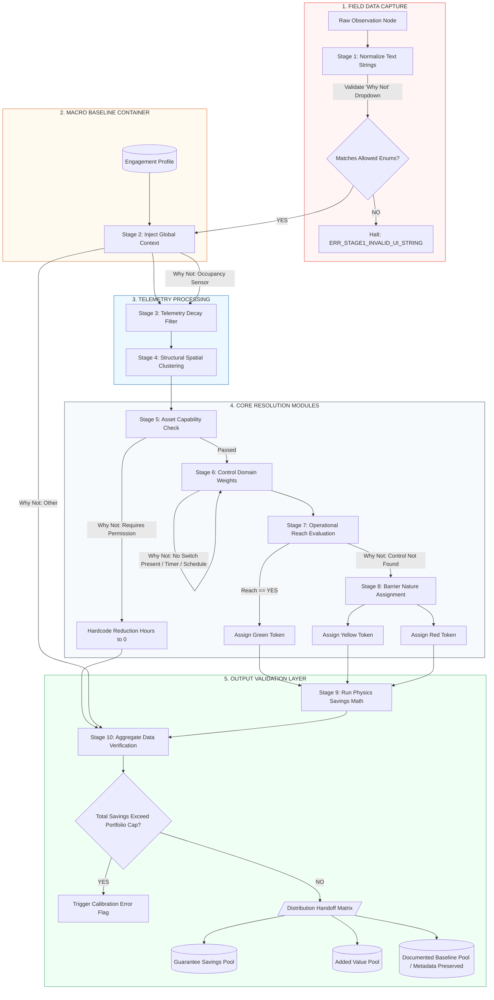

## SECTION 4 — 10-STAGE PIPELINE

The Inference Engine processes observations through a rigid 10-stage sequential pipeline. No stage may be bypassed. Observations must complete each stage in order before advancing.

1. **STAGE 1** — Ingestion and Normalization
2. **STAGE 2** — Global Portfolio Context (Macro Baseline Container)
3. **STAGE 3** — Localized Telemetry Context Filter
4. **STAGE 4** — Structural Spatial Clustering
5. **STAGE 5** — Asset Capability Resolution
6. **STAGE 6** — Control Domain Allocation
7. **STAGE 7** — Operational Reach Evaluation
8. **STAGE 8** — Barrier Nature Assignment
9. **STAGE 9** — Measure Generation and Savings Calculation
10. **STAGE 10** — Finding Pool Distribution and Output Validation

### 4.1 — Pipeline Logic Schematic

Below is the technical visualization of the 10-stage backend pipeline execution paths:


## SECTION 5 — STAGE SPECIFICATIONS

### 5.1 — STAGE 1: Ingestion and Normalization

#### 5.1.1 — Purpose
To ingest raw field observations from the mobile discovery interface, validate payload parameters, and normalize arbitrary text entries into strict system enums. If input verification fails, processing halts immediately before affecting data state.

#### 5.1.2 — UI Dropdown Field Enforcements ("Why Not" Rule-Couplet)
When a field observation record indicates that an asset was not deactivated by the surveyor (`did_you_turn_off == "NO"`), the ingestion API contract enforces an exact text string match against one of six allowed values. 

The inference engine executes a deterministic data-routing sequence strictly bounded by these values:

```json
{
  "type": "object",
  "properties": {
    "did_you_turn_off": { "type": "string", "enum": ["YES", "NO"] },
    "why_not_enum": {
      "type": "string",
      "enum": [
        "No Switch Present",
        "Requires Permission",
        "Occupancy Sensor",
        "Timer / Schedule",
        "Control Not Found",
        "Other"
      ]
    }
  },
  "required": ["did_you_turn_off"]
}
```
#### 5.1.3 — Programmatic Routing Paths

The inference engine executes a deterministic data-routing sequence strictly bounded by the validated `why_not_enum` values:

1. **"No Switch Present"**
   * **Target Route:** STAGE 6 — Control Domain Allocation
   * **Action:** Bypasses manual occupant routing; forces classification to a centralized circuit-level panel distribution loop.

2. **"Requires Permission"**
   * **Target Route:** STAGE 5 — Asset Capability Resolution
   * **Action:** Evaluates asset under the critical capability criteria profile. If verified as operational baseload, operational runtime reduction hours ($H_{\text{reduction}}$) are hard-coded to zero.

3. **"Occupancy Sensor"**
   * **Target Route:** STAGE 3 — Localized Telemetry Context Filter
   * **Action:** Injects a local sensor timeout multiplier variable to modulate mathematical runtime baselines.

4. **"Timer / Schedule"**
   * **Target Route:** STAGE 6 — Control Domain Allocation
   * **Action:** Links asset domain metrics directly to a mechanical timeclock or automated building automation schedule profile.

5. **"Control Not Found"**
   * **Target Route:** STAGE 7 — Operational Reach Evaluation
   * **Action:** Triggers the P7 Default operational restriction rule, forcing reach metrics to `UNKNOWN` and pushing the asset directly to Stage 8.

6. **"Other"**
   * **Target Route:** STAGE 10 — Finding Pool Distribution and Output Validation
   * **Action:** Categorizes record as an unresolved outlier anomaly. Affixes an immutable flag forcing a manual engineering review before report compilation.
