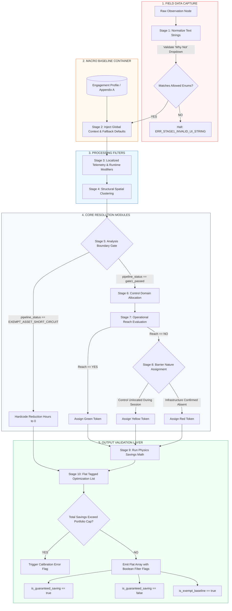

# Inference Engine Technical Specification (v3.1 Production)

## SECTION 1 — Executive System Overview

### 1.1 — Functional Role
The Inference Engine is the deterministic, server-side processing core responsible for transforming raw environmental observations into verified, audit-ready energy optimization measures. It serves as the single source of truth for calculations, risk token attribution, and portfolio financial modeling.

### 1.2 — System Decoupling (Frontend vs. Backend Contract)
To maintain structural agility and prevent logic fragmentation, the system enforces a strict architectural boundary between data acquisition and data processing:

* **The Discovery Studio (Frontend):** The mobile and web wireframes function purely as stateless capture mechanisms. The frontend UI is completely blind to savings math, asset wattages, utility structures, or routing topology. Its sole responsibility is to capture field states, validate user inputs against basic data types, and ship flat data structures.
* **The Inference Engine (Backend):** The engine functions as an isolated, deterministic state machine. It consumes the raw payload, injects global constraints, runs the physics modeling loops, and distributes results.


### 1.3 — Operational Boundaries
The engine does not utilize machine learning, predictive heuristics, or stochastic estimation. Every output state is a direct, traceable function of its inputs and fixed engineering constants. If the engine encounters an incomplete data state that cannot be resolved through predefined fallback rules, it is structurally mandated to halt processing for that node rather than generate an assumed value.

---

## SECTION 2 — Core Design Principles

To ensure absolute audit integrity and predictability across large asset portfolios, the Inference Engine must strictly adhere to the following architectural design principles:

### 2.1 — Zero Implicit Inference
The engine operates on a mandate of complete explicit verification. If data is absent, ambiguous, or un-mapped across onboarding databases or field payloads, the system is strictly prohibited from executing any of the following:
* Applying statistical averages or "most likely" defaults.
* Utilizing historical trends to fill missing telemetry or structural metrics.
* Inferring control layers based on asset types (e.g., assuming a light fixture is on a timer simply because it is located in a retail zone).

If a value is missing or unverified, the engine flags the record as `FLAGGED` and halts downstream math calculations for that node unless a centralized, auditable system baseline fallback rule is explicitly declared.

### 2.2 — Fail-Fast Pipeline Isolation
Data errors must never propagate down the pipeline. The sequence enforces a hard "validate-before-transform" gate at every stage interface. 
* Any data node that triggers a validation error code (e.g., `ERR_STAGE1_INVALID_UI_STRING`) immediately halts execution along its path.
* The engine isolates the invalid cluster or observation node, logs the precise failure signature, and allows valid clusters to continue unimpeded. 
* This prevents a single corrupt field entry from invalidating an entire building or portfolio processing run.

### 2.3 — Immutable Data Lineage
Data transformation throughout the 10 stages is entirely additive. The engine is structurally forbidden from overwriting raw incoming field data or early-stage context metadata. 
* As a payload advances through successive stages, the engine appends nested telemetry filters, capability arrays, and physics calculations into isolated wrapper objects. 
* This guarantees a transparent, deterministic audit trail from the ultimate dollar savings pool in Stage 10 back to the exact physical observation row captured by the field surveyor.

---

## SECTION 3 — Global Data Schemas

To ensure strict validation and execution, the Inference Engine requires all incoming payloads to conform to a standardized schema layout. This section details the data shape required for a raw observation package prior to pipeline ingestion.

### 3.1 — Raw Field Observation Contract
The basic unit of data injected into the engine from the field discovery interface is the `ObservationNode`. This schema defines the mandatory parameters required to execute Stage 1 validation.

```json
{
  "$schema": "[https://json-schema.org/draft/2020-12/schema](https://json-schema.org/draft/2020-12/schema)",
  "title": "ObservationNode",
  "type": "object",
  "properties": {
    "observation_id": {
      "type": "string",
      "description": "Unique, immutable UUID generated by the field device for tracking lineage."
    },
    "space_id": {
      "type": "string",
      "description": "Alpha-numeric identifier matching the master facility space directory."
    },
    "asset_sub_class": {
      "type": "string",
      "description": "Specific equipment classification taxonomy key used for physics math constants."
    },
    "field_count": {
      "type": "integer",
      "minimum": 1,
      "description": "Physical tally of active fixtures under this precise condition set."
    },
    "did_you_turn_off": {
      "type": "string",
      "enum": ["YES", "NO"],
      "description": "Primary behavioral gate recording surveyor physical interaction."
    },
    "why_not_enum": {
      "type": ["string", "null"],
      "enum": [
        "No Switch Present",
        "Requires Permission",
        "Occupancy Sensor",
        "Timer / Schedule",
        "Control Not Found",
        "Other",
        null
      ],
      "description": "Mandatory conditional drop-down response string required if did_you_turn_off is NO. Must be null if did_you_turn_off is YES."
    }
  },
  "required": [
    "observation_id",
    "space_id",
    "asset_sub_class",
    "field_count",
    "did_you_turn_off",
    "why_not_enum"
  ]
}
```

### 3.2 — Validation Constraint Logic
* **Conditional Enforcement Rule:** While `why_not_enum` allows a null type, the API gateway evaluation layer dictates that if `did_you_turn_off == "NO"`, a non-null string match from the allowed array must be present. If `why_not_enum` arrives as null while `did_you_turn_off == "NO"`, processing fails the schema contract and drops before entering Stage 1.
* **Taxonomy Alignment:** The `asset_sub_class` value must match the global engineering dictionary exactly. Case sensitivity is strictly enforced (e.g., `"LIGHTING_DISPLAY_ACCENT"` is valid; `"Lighting_Display_Accent"` will trigger an instant type-match termination).

---

## SECTION 4 — 10-STAGE PIPELINE

The Inference Engine processes observations through a rigid 10-stage sequential pipeline. No stage may be bypassed. Observations must complete each stage in order before advancing.

1. **STAGE 1** — Ingestion and Normalization
2. **STAGE 2** — Global Portfolio Context (Macro Baseline Container)
3. **STAGE 3** — Localized Telemetry Context & Runtime Modification
4. **STAGE 4** — Structural Spatial Clustering
5. **STAGE 5** — Asset Capability Resolution (Analysis Boundary Gate)
6. **STAGE 6** — Control Domain Allocation
7. **STAGE 7** — Operational Reach Evaluation
8. **STAGE 8** — Barrier Nature Assignment
9. **STAGE 9** — Measure Generation and Savings Calculation
10. **STAGE 10** — Finding Pool Distribution and Output Validation

### 4.1 — Pipeline Logic Schematic

Below is the technical visualization of the 10-stage backend pipeline execution paths:



---

## SECTION 5 — STAGE SPECIFICATIONS

### 5.1 — STAGE 1: Ingestion and Normalization

#### 5.1.1 — Purpose
To ingest raw field observations from the mobile discovery interface, validate payload parameters, and normalize arbitrary text entries into strict system enums. If input verification fails, processing halts immediately before affecting data state.

#### 5.1.2 — UI Dropdown Field Enforcements ("Why Not" Rule-Couplet)
When a field observation record indicates that an asset was not deactivated by the surveyor (`did_you_turn_off == "NO"`), the ingestion API contract enforces an exact text string match against one of six allowed values.

```json
{
  "type": "object",
  "properties": {
    "did_you_turn_off": { "type": "string", "enum": ["YES", "NO"] },
    "why_not_enum": {
      "type": "string",
      "enum": [
        "No Switch Present",
        "Requires Permission",
        "Occupancy Sensor",
        "Timer / Schedule",
        "Control Not Found",
        "Other"
      ]
    }
  },
  "required": ["did_you_turn_off"]
}
```

#### 5.1.3 — Programmatic Routing Paths
The inference engine executes a deterministic data-routing sequence strictly bounded by the validated `why_not_enum` values:

1. **"No Switch Present"**
   * **Target Route:** STAGE 6 — Control Domain Allocation
   * **Action:** Bypasses manual occupant routing; forces classification to a centralized circuit-level panel distribution loop.
2. **"Requires Permission"**
   * **Target Route:** STAGE 5 — Asset Capability Resolution
   * **Action:** Functions strictly as an assessment domain signal and credential gap. It routes to Stage 5 for capability mapping context rather than triggering an auto-zero or automated short-circuit calculation.
3. **"Occupancy Sensor"**
   * **Target Route:** STAGE 3 — Localized Telemetry Context & Runtime Modification
   * **Action:** Identifies a localized hardware sweep control and routes to Stage 3 to apply an automated runtime modifier adjustment.
4. **"Timer / Schedule"**
   * **Target Route:** STAGE 6 — Control Domain Allocation
   * **Action:** Links asset domain metrics directly to a mechanical timeclock or automated building automation schedule profile.
5. **"Control Not Found"**
   * **Target Route:** STAGE 7 — Operational Reach Evaluation
   * **Action:** Triggers the P7 Default operational visibility restriction rule, forcing immediate reach evaluation metrics to `"NO"` and advancing the packet to Stage 8.
6. **"Other"**
   * **Target Route:** STAGE 10 — Finding Pool Distribution and Output Validation
   * **Action:** Categorizes the record as an unresolved outlier anomaly. Affixes an immutable flag forcing a manual engineering review before report compilation, isolating it completely from automated saving algorithms.

---

### 5.2 — STAGE 2: Global Portfolio Context (Macro Baseline Container)

#### 5.2.1 — Purpose
To inject macro-environmental boundaries, localized utility rate structures, and pre-onboarded infrastructure baseline data into the validated observation stream. This stage executes a database-join cascade to reconcile drawings with field states, falling back to auditable default parameters if site documentation is incomplete.

#### 5.2.2 — Input Requirements
This stage accepts the validated JSON payload from Stage 1 and maps it against two static relational tables initialized during project onboarding:
1. **Table A: Pre-Onboarding Infrastructure Baseline** (As-built engineering drawings, panel schedules, and BMS sequences).
2. **Table B: Facilitator Site Walk Overrides** (Populated via the validation card interface).
3. **Appendix A: Centralized Control Assumption Defaults Matrix** (System-level fallback values based on taxonomy).

#### 5.2.3 — Ingestion Logic Hierarchy (The Cascade Rule)
To resolve the infrastructure context properties while ensuring the pipeline can proceed with progress calculations without throwing structural compilation errors, the engine executes a strict, top-down fallback cascade:

```text
Step 1: Query Table B for an active "Facilitator Override" matching the target space_id + asset_sub_class.
        ├── IF FOUND: Set resolved_control_domain = observed_control_enum.
        │             Set is_default_applied = false. Proceed to Stage 3.
        └── IF NOT FOUND: Proceed to Step 2.

Step 2: Query Table A for a "Pre-Onboarding Baseline" matching the target space_id + asset_sub_class.
        ├── IF FOUND: Set resolved_control_domain = doc_control_enum.
        │             Set is_default_applied = false. Proceed to Stage 3.
        └── IF NOT FOUND: Proceed to Step 3.

Step 3: Query Appendix A for a Centralized Control Default matching the target asset_sub_class taxonomy.
        ├── IF FOUND: Set resolved_control_domain = fallback_control_enum.
        │             Set is_default_applied = true.
        │             Set validation_status = "CLEARED_WITH_DEFAULTS". Proceed to Stage 3.
        └── IF NOT FOUND: Proceed to Step 4 (Ultimate Global Catch-All).

Step 4: Execute Ultimate Global Catch-All Rule for unclassified/unknown assets.
        ├── Action: Set resolved_control_domain = "LOCAL_MANUAL_SWITCH".
        │           Set is_default_applied = true.
        │           Set source_documentation_ref = "GLOBAL_CATCH_ALL_FALLBACK".
        │           Set validation_status = "RECONCILIATION_REQUIRED".
        └── Result: Payload clears Stage 2 with 100% throughput. Proceed to Stage 3.
```

#### 5.2.4 — Output Schema (Context-Injected Node)
Successful execution outputs an augmented data packet containing local field counts, global constraints, and default tracking trackers:
```json
{
  "space_id": "NR-1101",
  "asset_sub_class": "LIGHTING_DISPLAY_ACCENT",
  "field_count": 14,
  "global_context": {
    "blended_utility_rate_kwh": 0.318,
    "portfolio_spend_cap_kwh": 2400000,
    "resolved_control_domain": "LOCAL_MANUAL_SWITCH",
    "associated_panel_id": "BMS-P3-ZONE2",
    "source_documentation_ref": "APPENDIX_A_FALLBACK",
    "is_default_applied": true
  },
  "validation_status": "CLEARED_WITH_DEFAULTS"
}
```

---

### 5.3 — STAGE 3: Localized Telemetry Context & Runtime Modification

#### 5.3.1 — Purpose
To apply real-time telemetry inputs alongside localized environmental control observations to modify confidence scores and operating hours assumptions. This stage explicitly separates continuous external telemetry tracking from discrete, control-driven runtime modifiers before individual observations undergo spatial clustering.

#### 5.3.2 — Input Requirements
This stage accepts the context-injected payload from Stage 2 and evaluates active occupant/worker signals alongside field-recorded hardware sensor behaviors.

#### 5.3.3 — Processing and Filter Rules
The presence of local automated hardware or real-time presence signals alters baseline operational assumptions. The engine applies these evaluations in a single sequential pass:

1. **Live Telemetry Context Filters (Owls & Bulldogs):**
   * **Owl Processing:** If `owl_count` > 0 for a room, reduce the confidence score for illicit-load findings (default: -0.20 per Owl observed) and apply an hours adjustment to `H_reduction` based on irregular after-hours presence frequency. Context signals modify assumptions; they do not suppress findings.
   * **Bulldog Processing:** Evaluates non-occupant workers by role type (Security, Cleaning, Contractor, Unknown) to apply time-bound confidence reductions to affected floors or zones during their active influence windows without deleting findings.
2. **Control-Based Runtime Modifiers (Occupancy Sensors):**
   * If `why_not_enum == "Occupancy Sensor"`, the engine recognizes that an automated local hardware sweep control is active rather than a continuous live tracking stream. It queries the system database for the site's verified sensor timeout sweep constant ($F_{\text{telemetry}}$).
   * If the constant is present, it is mapped to the asset node as `telemetry_decay_factor` to scale the downstream potential waste-runtime window (e.g., a constant of `0.75` accounting for a 25% reduction in unmanaged runtime due to integrated sensor cycling).
   * If the sensor constant is missing from the portfolio database configuration, the engine is prohibited from assuming an arbitrary default value. Set `telemetry_decay_factor = null`, mark `validation_status = "FLAGGED"`, log `ERR_STAGE3_MISSING_SENSOR_CONSTANT`, and terminate processing.
3. **Standard Baseline Default Rule:**
   * For observations where `why_not_enum` does not equal `"Occupancy Sensor"`, no automated runtime adjustments are applied at this layer. Set `telemetry_decay_factor = 1.0` and preserve the default unmanaged waste hour constant asset assumptions intact.

#### 5.3.4 — Output Schema (Telemetry-Filtered Node)
Successful execution appends the computed runtime modifier value directly to the tracking metadata wrapper:
```json
{
  "space_id": "NR-1101",
  "asset_sub_class": "LIGHTING_DISPLAY_ACCENT",
  "field_count": 14,
  "global_context": {
    "blended_utility_rate_kwh": 0.318,
    "portfolio_spend_cap_kwh": 2400000,
    "resolved_control_domain": "LOCAL_MANUAL_SWITCH",
    "associated_panel_id": "BMS-P3-ZONE2",
    "source_documentation_ref": "APPENDIX_A_FALLBACK",
    "is_default_applied": true
  },
  "telemetry_filter": {
    "telemetry_decay_factor": 1.0,
    "applied_signal_source": "standard_baseline_default"
  },
  "validation_status": "CLEARED_WITH_DEFAULTS"
}
```

---

### 5.4 — STAGE 4: Structural Spatial Clustering

#### 5.4.1 — Purpose
To execute data array compression by grouping individual observation rows into unified spatial system clusters. The engine aggregates data to eliminate duplicate computation loops while preserving unique lineage back to the raw field entries.

#### 5.4.2 — Input Requirements
This stage accepts a stream or array of individual telemetry-filtered nodes from Stage 3.

#### 5.4.3 — Clustering Mechanics & Boundary Rules
The clustering loop is completely deterministic and operates on a strict composite key constraint. It executes according to the following mathematical grouping logic:

1. **The Composite Key Enforcer:**
   * Observations are grouped if and only if they share an identical **`space_id`** AND an identical **`asset_sub_class`**.
   * If two observations share the same `space_id` but have different `asset_sub_class` taxonomies, they must be split into separate system clusters.
   * Cross-room or cross-zone spatial blending is strictly prohibited.
2. **Aggregation Agglomeration:**
   * For matching nodes, the totalized count ($C_{\text{cluster}}$) is calculated as the sum of all individual field counts:
     $$C_{\text{cluster}} = \sum_{i=1}^{n} C_i$$
   * Where $C_i$ represents the individual `field_count` value for node $i$.
   * Individual `observation_id` string flags are aggregated into a flat tracking array (`source_observation_ids`) to preserve data lineage for downstream audits.
3. **Context Reconciliation:**
   * If any matching observations contain conflicting `global_context` attributes (e.g., mismatched panel IDs for the same asset class in the same room), the engine cannot select an average or a majority. Execution halts instantly, flagging the entire spatial group as `FLAGGED` with error code `ERR_STAGE4_SPATIAL_CONTEXT_CONFLICT`.

#### 5.4.4 — Output Schema (Unified Cluster Object)
Successful execution reduces the stream size, handing off a structured array of unique system clusters:
```json
[
  {
    "cluster_id": "cluster_nr_1101_lighting_display_accent",
    "space_id": "NR-1101",
    "asset_sub_class": "LIGHTING_DISPLAY_ACCENT",
    "total_cluster_count": 14,
    "source_observation_ids": ["raw_83", "raw_104"],
    "aggregated_context": {
      "blended_utility_rate_kwh": 0.318,
      "portfolio_spend_cap_kwh": 2400000,
      "resolved_control_domain": "LOCAL_MANUAL_SWITCH",
      "associated_panel_id": "BMS-P3-ZONE2",
      "telemetry_decay_factor": 1.0,
      "is_default_applied": true
    },
    "validation_status": "CLEARED_WITH_DEFAULTS"
  }
]
```

---

### 5.5 — STAGE 5: Asset Capability Resolution (Analysis Boundary Gate)

#### 5.5.1 — Purpose
To execute Gate 1 of the Performance Map classification logic and determine whether an asset is physically capable of supporting a correction in its current state, while validating verified administrative scope limits via the Exemption Gate.

#### 5.5.2 — Input Requirements
This stage accepts the unified spatial cluster arrays from Stage 4 and evaluates asset condition parameters alongside the active session's administrative boundary configurations.

#### 5.5.3 — Resolution Sequence & The Exemption Gate
The engine is strictly prohibited from inferring continuous baseline states or mechanical capacity constraints from surveyor operational session limitations like `why_not_enum == "Requires Permission"`. This response indicates a boundary domain signal and a surveyor
