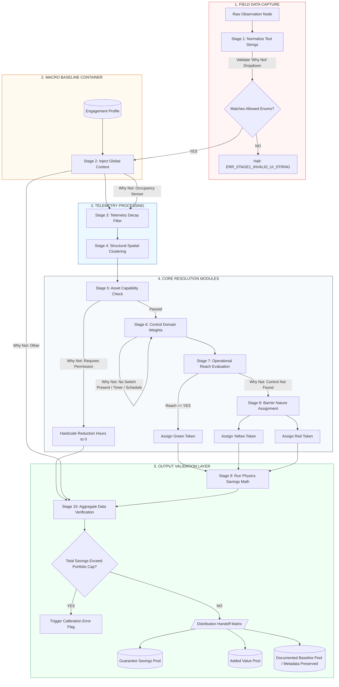

## SECTION 4 — 10-STAGE PIPELINE

The Inference Engine processes observations through a rigid 10-stage sequential pipeline. No stage may be bypassed. Observations must complete each stage in order before advancing.

1. **STAGE 1** — Ingestion and Normalization
2. **STAGE 2** — Global Portfolio Context (Macro Baseline Container)
3. **STAGE 3** — Localized Telemetry Context Filter
4. **STAGE 4** — Structural Spatial Clustering
5. **STAGE 5** — Asset Capability Resolution
6. **STAGE 6** — Control Domain Allocation
7. **STAGE 7** — Operational Reach Evaluation
8. **STAGE 8** — Barrier Nature Assignment
9. **STAGE 9** — Measure Generation and Savings Calculation
10. **STAGE 10** — Finding Pool Distribution and Output Validation

### 4.1 — Pipeline Logic Schematic

Below is the technical visualization of the 10-stage backend pipeline execution paths:


## SECTION 5 — STAGE SPECIFICATIONS

### 5.1 — STAGE 1: Ingestion and Normalization

#### 5.1.1 — Purpose
To ingest raw field observations from the mobile discovery interface, validate payload parameters, and normalize arbitrary text entries into strict system enums. If input verification fails, processing halts immediately before affecting data state.

#### 5.1.2 — UI Dropdown Field Enforcements ("Why Not" Rule-Couplet)
When a field observation record indicates that an asset was not deactivated by the surveyor (`did_you_turn_off == "NO"`), the ingestion API contract enforces an exact text string match against one of six allowed values. 

The inference engine executes a deterministic data-routing sequence strictly bounded by these values:

```json
{
  "type": "object",
  "properties": {
    "did_you_turn_off": { "type": "string", "enum": ["YES", "NO"] },
    "why_not_enum": {
      "type": "string",
      "enum": [
        "No Switch Present",
        "Requires Permission",
        "Occupancy Sensor",
        "Timer / Schedule",
        "Control Not Found",
        "Other"
      ]
    }
  },
  "required": ["did_you_turn_off"]
}
```
#### 5.1.3 — Programmatic Routing Paths

The inference engine executes a deterministic data-routing sequence strictly bounded by the validated `why_not_enum` values:

1. **"No Switch Present"**
   * **Target Route:** STAGE 6 — Control Domain Allocation
   * **Action:** Bypasses manual occupant routing; forces classification to a centralized circuit-level panel distribution loop.

2. **"Requires Permission"**
   * **Target Route:** STAGE 5 — Asset Capability Resolution
   * **Action:** Evaluates asset under the critical capability criteria profile. If verified as operational baseload, operational runtime reduction hours ($H_{\text{reduction}}$) are hard-coded to zero.

3. **"Occupancy Sensor"**
   * **Target Route:** STAGE 3 — Localized Telemetry Context Filter
   * **Action:** Injects a local sensor timeout multiplier variable to modulate mathematical runtime baselines.

4. **"Timer / Schedule"**
   * **Target Route:** STAGE 6 — Control Domain Allocation
   * **Action:** Links asset domain metrics directly to a mechanical timeclock or automated building automation schedule profile.

5. **"Control Not Found"**
   * **Target Route:** STAGE 7 — Operational Reach Evaluation
   * **Action:** Triggers the P7 Default operational restriction rule, forcing reach metrics to `UNKNOWN` and pushing the asset directly to Stage 8.

### 5.2 — STAGE 2: Global Portfolio Context (Macro Baseline Container)

#### 5.2.1 — Purpose
To inject macro-environmental boundaries, localized utility rate structures, and pre-onboarded infrastructure baseline data into the validated observation stream. This stage executes a strict database-join cascade to reconcile physical drawings with field observations.

#### 5.2.2 — Input Requirements
This stage accepts the validated JSON payload from Stage 1 and maps it against two static relational tables initialized during project onboarding:

1. **Table A: Pre-Onboarding Infrastructure Baseline** (Compiled from as-built engineering drawings, panel schedules, and BMS sequences).
2. **Table B: Facilitator Site Walk Overrides** (Populated via the exception-driven validation card interface).

#### 5.2.3 — Ingestion Logic Hierarchy (The Cascade Rule)
To resolve the infrastructure context properties without relying on implicit system assumptions, the engine executes a strict, top-down fallback cascade. It is prohibited from guessing if data is absent across all data assets.

```text
Step 1: Query Table B for an active "Facilitator Override" matching the target space_id + asset_sub_class.
        ├── IF FOUND: Set resolved_control_domain = observed_control_enum. Proceed to Stage 3.
        └── IF NOT FOUND: Proceed to Step 2.

Step 2: Query Table A for a "Pre-Onboarding Baseline" matching the target space_id + asset_sub_class.
        ├── IF FOUND: Set resolved_control_domain = doc_control_enum. Proceed to Stage 3.
        └── IF NOT FOUND: Proceed to Step 3.

Step 3: Force Resolution to NULL.
        ├── Set resolved_control_domain = null
        ├── Set validation_status = FLAGGED
        └── Append ERR_STAGE2_CONTROL_DATA_MISSING to payload log. Halt pipeline execution.  


6. **"Other"**
   * **Target Route:** STAGE 10 — Finding Pool Distribution and Output Validation
   * **Action:** Categorizes record as an unresolved outlier anomaly. Affixes an immutable flag forcing a manual engineering review before report compilation.
```
#### 5.2.4 - Output Schema (Context-Injected Node)
Successful execution outputs an augmented data packet containing both local field counts and global portfolio constraints:
```json
{
  "space_id": "NR-1101",
  "asset_sub_class": "LIGHTING_DISPLAY_ACCENT",
  "field_count": 14,
  "global_context": {
    "blended_utility_rate_kwh": 0.318,
    "portfolio_spend_cap_kwh": 2400000,
    "resolved_control_domain": "BMS_RELAY_PANEL",
    "associated_panel_id": "BMS-P3-ZONE2",
    "source_documentation_ref": "E-104-REV2"
  },
  "validation_status": "CLEARED"
}
```
### 5.3 — STAGE 3: Localized Telemetry Context Filter

#### 5.3.1 — Purpose
To apply real-time telemetry signals, environmental sensor parameters, and behavioral modifiers to the context-injected stream. This stage scales the baseline waste-runtime window using deterministic decay factors (e.g., modulating hours based on the presence of an occupancy sensor).

#### 5.3.2 — Input Requirements
This stage accepts the context-injected payload from Stage 2, specifically evaluating the `why_not_enum` value resolved in Stage 1 alongside the building's localized profile.

#### 5.3.3 — Telemetry Decay Logic Rules
To adjust runtime calculations without predictive guessing, the engine applies explicit mathematical scale factors based on the verified control telemetry:

1. **Occupancy Sensor Verification Rule:**
   * If `why_not_enum == "Occupancy Sensor"`, the engine queries the global portfolio telemetry table for the specific site's verified sensor timeout interval constant ($T_{\text{timeout}}$).
   * If the constant is present, set `telemetry_decay_factor` = $T_{\text{timeout}}$ (e.g., `0.75`, representing a 25% reduction in unmanaged runtime due to automated sensor sweep cycles).
   * If the constant is missing from the portfolio configuration database, the engine is prohibited from assuming a default. Set `telemetry_decay_factor = null`, flag the node as `FLAGGED`, append `ERR_STAGE3_MISSING_SENSOR_CONSTANT`, and halt execution.

2. **Standard Schedule Filter Rule:**
   * If `why_not_enum` matches "Timer / Schedule", "No Switch Present", or "Control Not Found", telemetry adjustments are not applied at this layer. Set `telemetry_decay_factor = 1.0`.

#### 5.3.4 — Output Schema (Telemetry-Filtered Node)
Successful execution appends the computed runtime modifier value directly to the tracking metadata wrapper:

```json
{
  "space_id": "NR-1101",
  "asset_sub_class": "LIGHTING_DISPLAY_ACCENT",
  "field_count": 14,
  "global_context": {
    "blended_utility_rate_kwh": 0.318,
    "portfolio_spend_cap_kwh": 2400000,
    "resolved_control_domain": "BMS_RELAY_PANEL",
    "associated_panel_id": "BMS-P3-ZONE2",
    "source_documentation_ref": "E-104-REV2"
  },
  "telemetry_filter": {
    "telemetry_decay_factor": 0.75,
    "applied_signal_source": "why_not_enum_occupancy_sensor"
  },
  "validation_status": "CLEARED"
}
```
### 5.4 — STAGE 4: Structural Spatial Clustering

#### 5.4.1 — Purpose
To execute data array compression by grouping individual observation rows into unified spatial system clusters. The engine aggregates data to eliminate duplicate computation loops while preserving unique lineage back to the raw field entries.

#### 5.4.2 — Input Requirements
This stage accepts a stream or array of individual telemetry-filtered nodes from Stage 3. 

#### 5.4.3 — Clustering Mechanics & Boundary Rules
The clustering loop is completely deterministic and operates on a strict composite key constraint. It executes according to the following mathematical grouping logic:

1. **The Composite Key Enforcer:**
   * Observations are grouped if and only if they share an identical **`space_id`** AND an identical **`asset_sub_class`**.
   * If two observations share the same `space_id` but have different `asset_sub_class` taxonomies, they must be split into separate system clusters.
   * Cross-room or cross-zone spatial blending is strictly prohibited.

2. **Aggregation Agglomeration:**
   * For matching nodes, the totalized count ($C_{\text{cluster}}$) is calculated as the sum of all individual field counts:
     $$C_{\text{cluster}} = \sum_{i=1}^{n} \text{field\_count}_i$$
   * Individual `observation_id` string flags are aggregated into a flat tracking array (`source_observation_ids`) to preserve data lineage for downstream audits.

3. **Context Reconciliation:**
   * If any matching observations contain conflicting `global_context` attributes (e.g., mismatched panel IDs for the same asset class in the same room), the engine cannot select an average or a majority. Execution halts instantly, flagging the entire spatial group as `FLAGGED` with error code `ERR_STAGE4_SPATIAL_CONTEXT_CONFLICT`.

#### 5.4.4 — Output Schema (Unified Cluster Object)
Successful execution reduces the stream size, handing off a structured array of unique system clusters:

```json
[
  {
    "cluster_id": "cluster_nr_1101_lighting_display_accent",
    "space_id": "NR-1101",
    "asset_sub_class": "LIGHTING_DISPLAY_ACCENT",
    "total_cluster_count": 14,
    "source_observation_ids": ["raw_83", "raw_104"],
    "aggregated_context": {
      "blended_utility_rate_kwh": 0.318,
      "portfolio_spend_cap_kwh": 2400000,
      "resolved_control_domain": "BMS_RELAY_PANEL",
      "associated_panel_id": "BMS-P3-ZONE2",
      "telemetry_decay_factor": 0.75
    },
    "validation_status": "CLEARED"
  }
]
```
### 5.5 — STAGE 5: Asset Capability Resolution

#### 5.5.1 — Purpose
To evaluate whether the clustered equipment possesses the operational freedom, functional health, or baseline stability to undergo energy optimization. This stage acts as a primary safety gateway, immediately short-circuiting and preserving critical facility baseloads that cannot be modulated.

#### 5.5.2 — Input Requirements
This stage accepts the unified spatial cluster arrays from Stage 4 and evaluates the underlying `why_not_enum` tracking arrays along with asset health states.

#### 5.5.3 — Resolution Logic (The "Requires Permission" Short-Circuit)
To guarantee that optimization logic never interferes with critical facility runtime demands, the engine runs a strict capability check before allocating control domain pathways:

1. **The Code 5 Baseload Trigger:**
   * The engine scans the source observation metadata within the cluster. If any underlying observation row contains the value `why_not_enum == "Requires Permission"`, the engine immediately classifies the cluster under capability status **Code 5: `necessary_baseload`**.
   * **The Zero-Hour Mandate:** When Code 5 is tripped, the system sets the ultimate operational runtime reduction hours to zero:
     $$H_{\text{reduction}} = 0$$
   * **Path routing:** The cluster's `capability_status` is updated to `RESOLVED_SHORT_CIRCUIT`. It completely bypasses the control, reach, and barrier analysis loops (Stages 6, 7, and 8) and is routed directly to Stage 10 for baseline metadata preservation.

2. **Normal Status Advancement:**
   * If the cluster contains no instances of "Requires Permission" and the equipment status is marked functional, set `capability_status = PASSED` and advance the cluster intact to Stage 6.

#### 5.5.4 — Output Schema (Capability-Resolved Object)
Example of a cluster packet that has triggered the Code 5 baseline short-circuit:

```json
{
  "cluster_id": "cluster_nr_1101_lighting_display_accent",
  "space_id": "NR-1101",
  "asset_sub_class": "LIGHTING_DISPLAY_ACCENT",
  "total_cluster_count": 14,
  "source_observation_ids": ["raw_83", "raw_104"],
  "aggregated_context": {
    "blended_utility_rate_kwh": 0.318,
    "portfolio_spend_cap_kwh": 2400000,
    "resolved_control_domain": "BMS_RELAY_PANEL",
    "associated_panel_id": "BMS-P3-ZONE2",
    "telemetry_decay_factor": 0.75
  },
  "capability_resolution": {
    "capability_status": "RESOLVED_SHORT_CIRCUIT",
    "capability_code": "CODE_5_NECESSARY_BASELOAD",
    "forced_hours_reduction": 0,
    "bypass_engineering_gates": true
  },
  "validation_status": "CLEARED"
}
```
### 5.6 — STAGE 6: Control Domain Allocation

#### 5.6.1 — Purpose
To categorize and map the exact mechanical, electrical, or behavioral control vector governing the equipment cluster. This stage establishes the structural boundaries of where a control intervention must physically take place (e.g., at the local wall plate versus a centralized breaker panel).

#### 5.6.2 — Input Requirements
This stage accepts equipment clusters that successfully cleared the Stage 5 capability gateway (`capability_status == "PASSED"`).

#### 5.6.3 — Allocation & Weighting Logic
The engine evaluates the cluster's context and the validated `why_not_enum` state to explicitly assign a `control_domain_type`. No assumptions are permitted; any unmapped infrastructure links force an immediate processing halt.

1. **"No Switch Present" Mapping Rule:**
   * If `why_not_enum == "No Switch Present"`, the engine overrides any local occupant assumptions and binds the cluster to a branch circuit panel topology.
   * Set `control_domain_type = "CENTRAL_PANEL_LOOP"`.
   * The engine checks for a valid `associated_panel_id` injected during Stage 2. If the field is `null`, it trips `ERR_STAGE6_MISSING_PANEL_TOPOLOGY`, flags the cluster, and halts.

2. **"Timer / Schedule" Mapping Rule:**
   * If `why_not_enum == "Timer / Schedule"`, the engine binds the control logic to centralized automation frameworks.
   * Set `control_domain_type = "AUTOMATED_SCHEDULE"`.

3. **"YES" (Turned Off) Mapping Rule:**
   * If the underlying observation records resolved to `did_you_turn_off == "YES"`, the control vector is occupant-dependent.
   * Set `control_domain_type = "LOCAL_MANUAL_SWITCH"`.

4. **Missing Infrastructure Check:**
   * If a cluster arrives with an unpopulated `resolved_control_domain` from Stage 2 and cannot be resolved by these rules, the engine sets `control_domain_type = null`, marks `validation_status = "FLAGGED"`, appends `ERR_STAGE6_CONTROL_DOMAIN_UNRESOLVED`, and terminates the execution path.

#### 5.6.4 — Output Schema (Control-Allocated Object)
Successful execution updates the cluster with its verified physical control boundaries:

```json
{
  "cluster_id": "cluster_nr_1101_lighting_display_accent",
  "space_id": "NR-1101",
  "asset_sub_class": "LIGHTING_DISPLAY_ACCENT",
  "total_cluster_count": 14,
  "source_observation_ids": ["raw_83", "raw_104"],
  "aggregated_context": {
    "blended_utility_rate_kwh": 0.318,
    "portfolio_spend_cap_kwh": 2400000,
    "associated_panel_id": "BMS-P3-ZONE2",
    "telemetry_decay_factor": 1.0
  },
  "capability_resolution": {
    "capability_status": "PASSED",
    "capability_code": "FUNCTIONAL_OPTIMIZABLE"
  },
  "control_allocation": {
    "control_domain_type": "CENTRAL_PANEL_LOOP",
    "control_layer_validated": true
  },
  "validation_status": "CLEARED"
}
```
### 5.7 — STAGE 7: Operational Reach Evaluation

#### 5.7.1 — Purpose
To evaluate whether the operating entity possesses the contractual, legal, or logistical authority—termed "operational reach"—to execute an intervention on the allocated control domain. This stage separates easily accessible changes from those blocked by organizational boundaries.

#### 5.7.2 — Input Requirements
This stage accepts equipment clusters that successfully completed Stage 6 (`control_layer_validated == true`).

#### 5.7.3 — Reach Evaluation & The P7 Default Rule
The engine checks organizational authorization logs and the field data to resolve the `operational_reach_status`. Implicit assumptions are strictly forbidden.

1. **The P7 Default Rule ("Control Not Found"):**
   * If the cluster contains any underlying observation records where `why_not_enum == "Control Not Found"`, the engine triggers the **P7 Default Rule**.
   * **The Logic:** Because the physical control mechanism cannot be located by the field team, the engine determines that the client possesses no immediate operational visibility or reach over the asset.
   * **Action:** Force `operational_reach_status = "NO"`. The cluster is barred from advancing directly to a green pathway and is routed immediately to **STAGE 8 — Barrier Nature Assignment**.

2. **Standard Reach Validation:**
   * If `why_not_enum` does not contain "Control Not Found", the engine queries the site's vendor contract database for the allocated `control_domain_type` (resolved in Stage 6).
   * **Reach == YES:** If the contract profiles show the client has in-house maintenance authority or an active service contract to alter the control loop, set `operational_reach_status = "YES"`. The cluster skips Stage 8 and maps directly to the **Green Behavioral Token** path.
   * **Reach == NO:** If the control loop belongs to an uncooperative landlord, a third-party base-building system, or a vendor with an `UNKNOWN` relationship status, set `operational_reach_status = "NO"` and route the cluster to Stage 8.

#### 5.7.4 — Output Schema (Reach-Evaluated Object)
Example of an asset cluster where the control mechanism was missing in the field, triggering the P7 Default Rule:

```json
{
  "cluster_id": "cluster_nr_1101_lighting_display_accent",
  "space_id": "NR-1101",
  "asset_sub_class": "LIGHTING_DISPLAY_ACCENT",
  "total_cluster_count": 14,
  "source_observation_ids": ["raw_83", "raw_104"],
  "control_allocation": {
    "control_domain_type": "CENTRAL_PANEL_LOOP",
    "control_layer_validated": true
  },
  "operational_reach": {
    "operational_reach_status": "NO",
    "reach_evaluation_code": "P7_RULE_CONTROL_NOT_FOUND",
    "skip_barrier_analysis": false
  },
  "validation_status": "CLEARED"
}
```
### 5.8 — STAGE 8: Barrier Nature Assignment

#### 5.8.1 — Purpose
To evaluate clusters that failed the Stage 7 operational reach gateway (`operational_reach_status == "NO"`) and classify the structural or administrative obstacle preventing immediate implementation. This stage assigns a definitive **Yellow** or **Red** token path to govern downstream measure generation metrics.

#### 5.8.2 — Input Requirements
This stage accepts equipment clusters with an evaluated `operational_reach_status` of `NO`. 

#### 5.8.3 — Barrier Classification & Token Attribution Logic
The engine analyzes the validated `why_not_enum` value and infrastructure metrics to bifurcate entries into two distinct operational pathways:

1. **Yellow Pathway Token (Operational / Logic Barriers):**
   * **Criteria:** The barrier is administrative, programmatic, or software-driven. Implementing the optimization requires logic reconfiguration, system re-programming, or contract modification rather than physical hardware reconstruction.
   * **Trigger Conditions:** * `why_not_enum == "Timer / Schedule"` AND Reach is `NO`
     * `why_not_enum == "No Switch Present"` AND Reach is `NO` (where existing central BMS controls are confirmed but un-networked or restricted by vendor profiles).
   * **Action:** Assign `pathway_token = "YELLOW"`. Set operational category to `LOGIC_CONFIGURATION_BARRIER`.

2. **Red Pathway Token (Structural / Capital Barriers):**
   * **Criteria:** The barrier is tied to missing physical hardware, hidden routing infrastructure, or structural real estate layout boundaries. Resolution requires physical engineering exploration, significant capital investment, or hardware deployment.
   * **Trigger Conditions:**
     * `why_not_enum == "Control Not Found"` (The absolute absence of visible localized or structural control mechanisms requires physical tracing and capital installation of points).
   * **Action:** Assign `pathway_token = "RED"`. Set operational category to `STRUCTURAL_INFRASTRUCTURE_BARRIER`.

#### 5.8.4 — Output Schema (Barrier-Assigned Object)
Example of a cluster assigned a Red Token path due to unmapped control systems:

```json
{
  "cluster_id": "cluster_nr_1101_lighting_display_accent",
  "space_id": "NR-1101",
  "asset_sub_class": "LIGHTING_DISPLAY_ACCENT",
  "control_allocation": {
    "control_domain_type": "CENTRAL_PANEL_LOOP"
  },
  "operational_reach": {
    "operational_reach_status": "NO",
    "reach_evaluation_code": "P7_RULE_CONTROL_NOT_FOUND"
  },
  "barrier_assignment": {
    "pathway_token": "RED",
    "barrier_operational_category": "STRUCTURAL_INFRASTRUCTURE_BARRIER",
    "engineering_override_required": true
  },
  "validation_status": "CLEARED"
}
```
### 5.9 — STAGE 9: Measure Generation and Savings Calculation

#### 5.9.1 — Purpose
To run the deterministic engineering physics core. This stage calculates the baseline power load, annual unmanaged waste run-time hours, net energy reduction, and financial impacts of the proposed intervention. All equations are strictly bounded by asset taxonomy constants and the telemetry decay values assigned upstream.

#### 5.9.2 — Input Requirements
This stage accepts all processed equipment clusters. This includes both active optimization candidates (Green, Yellow, and Red tokens) and short-circuited baseload entries.

#### 5.9.3 — Physics Calculations & Deterministic Formulas

The engine runs a four-step calculation sequence using fixed constants mapped to the specific `asset_sub_class`. No historical averaging or statistical smoothing is permitted.

**Step 1: Connected Cluster Load ($P_{\text{load}}$)**
The total electrical load for the system cluster is calculated by multiplying the aggregated count by the baseline fixture wattage constant ($W_{\text{fixture}}$) defined in the system asset catalog:

$$P_{\text{load}} = \left( C_{\text{cluster}} \times W_{\text{fixture}} \right) \times 10^{-3}$$

* $P_{\text{load}}$ = Total connected cluster load in kilowatts ($\text{kW}$).
* $C_{\text{cluster}}$ = Total item count (`total_cluster_count`).
* $W_{\text{fixture}}$ = Sub-class equipment baseline wattage (e.g., $50\text{W}$ for Halogen Track, $15\text{W}$ for LED Can).

**Step 2: Realized Operational Hours Reduction ($H_{\text{reduction}}$)**
The engine computes the potential waste-hour compression window. 
* If `capability_code == "CODE_5_NECESSARY_BASELOAD"`, the reduction hours are hardcoded:
    $$H_{\text{reduction}} = 0$$
* For optimizable paths, the engine reads the default sub-class unmanaged waste hour constant ($H_{\text{waste}}$) and scales it by the telemetry decay multiplier:
    $$H_{\text{reduction}} = H_{\text{waste}} \times \text{telemetry\_decay\_factor}$$

**Step 3: Annualized Energy Savings ($E_{\text{savings}}$)**
Net electrical consumption reduction is calculated as a direct product of load and time:

$$E_{\text{savings}} = P_{\text{load}} \times H_{\text{reduction}}$$

* $E_{\text{savings}}$ = Annualized energy savings in kilowatt-hours ($\text{kWh}$).

**Step 4: Financial Savings Generation ($S_{\text{financial}}$)**
The ultimate localized fiscal impact uses the specific blended rate ($R_{\text{utility}}$) injected during Stage 2:

$$S_{\text{financial}} = E_{\text{savings}} \times R_{\text{utility}}$$

* $S_{\text{financial}}$ = Realized annual cost reduction in gross dollars ($\text{\$}$).
* $R_{\text{utility}}$ = Localized blended utility rate (`blended_utility_rate_kwh`).

#### 5.9.4 — Output Schema (Calculated Savings Object)
The cluster object is updated with the complete deterministic physics payload:

```json
{
  "cluster_id": "cluster_nr_1101_lighting_display_accent",
  "space_id": "NR-1101",
  "asset_sub_class": "LIGHTING_DISPLAY_ACCENT",
  "barrier_assignment": {
    "pathway_token": "RED",
    "barrier_operational_category": "STRUCTURAL_INFRASTRUCTURE_BARRIER"
  },
  "physics_calculations": {
    "calculated_p_load_kw": 0.70,
    "calculated_h_reduction": 3500.0,
    "annual_energy_savings_kwh": 2450.0,
    "annual_financial_savings_usd": 779.10,
    "math_execution_verified": true
  },
  "validation_status": "CLEARED"
}
```
```markdown
### 5.10 — STAGE 10: Finding Pool Distribution and Output Validation

#### 5.10.1 — Purpose
To execute macro portfolio-level boundary validation checks and sort fully calculated system clusters into isolated client-facing delivery pools. This stage acts as the ultimate quality assurance gate, intercepting processing anomalies and separating capital configuration assets from qualitative baseline records.

#### 5.10.2 — Input Requirements
This stage accepts the array of calculated system cluster objects from Stage 9. It requires access to the global portfolio constraints (`portfolio_spend_cap_kwh`) injected during Stage 2.

#### 5.10.3 — Portfolio Validation & Sorting Rules

Before populating the output arrays, the engine processes the completed cluster stream through two strict algorithmic validation filters:

1. **Portfolio Spend Cap Boundary Check:**
   * The engine totalizes the annualized energy savings across all processed clusters:
     $$\text{Total Portfolio Savings} = \sum_{i=1}^{m} E_{\text{savings}, i}$$
   * **The Limit Gate:** If the Total Portfolio Savings exceeds the pre-onboarded cap parameter (`portfolio_spend_cap_kwh`), the engine identifies a physical modeling failure. 
   * **Action:** Halt distribution routing. Mark the entire run status as `FAILED`, append error code `ERR_STAGE10_PORTFOLIO_CAP_EXCEEDED` to the master execution log, and block delivery generation.

2. **The "Other" Isolation Routine:**
   * The engine scans for any cluster where `why_not_enum == "Other"`.
   * **Action:** These entries are intercepted and stripped from automated distribution routing. The engine assigns a `FACILITATOR_REVIEW_REQUIRED` state tag and isolates the record in an anomaly bucket for manual engineering reconciliation.

3. **Distribution Handoff Sorting Matrix:**
   Cleanly validated clusters that bypass the boundary errors are split into three definitive target destination arrays based on their token state and financial significance:

   * **Guaranteed Savings Pool:** Contains active optimization clusters flagged with **Yellow** or **Red** pathway tokens where calculated savings clear project significance floors. These represent hard infrastructure or programmatic adjustments.
   * **Added Value Opportunity Pool:** Contains active optimization clusters flagged with **Green** pathway tokens, alongside any tokenized entries that fall below the primary project significance limits. These are categorized as supplementary operational or behavioral coaching opportunities.
   * **Documented Baseline Pool:** Contains all short-circuited nodes tagged with capability state `RESOLVED_SHORT_CIRCUIT` (Code 5 Baseload). Annual energy savings are locked at 0, but the rich mechanical, asset class, and control metadata are preserved intact for facility compliance auditing.

#### 5.10.4 — Output Schema (Master Distribution Object)
The final delivered execution packet compiles the isolated pools into a single, clean JSON structure ready for generation handoff:

```json
{
  "portfolio_run_id": "run_2026_05_north_wing",
  "execution_timestamp": "2026-05-22T19:15:30Z",
  "portfolio_validation": {
    "total_calculated_savings_kwh": 2600.0,
    "portfolio_spend_cap_kwh": 2400000.0,
    "boundary_check_passed": true
  },
  "delivery_pools": {
    "guaranteed_savings_pool": [
      {
        "cluster_id": "cluster_nr_1101_lighting_display_accent",
        "space_id": "NR-1101",
        "asset_sub_class": "LIGHTING_DISPLAY_ACCENT",
        "pathway_token": "RED",
        "annual_energy_savings_kwh": 2450.0,
        "annual_financial_savings_usd": 779.10
      }
    ],
    "added_value_pool": [
      {
        "cluster_id": "cluster_nr_1101_lighting_recessed_can",
        "space_id": "NR-1101",
        "asset_sub_class": "LIGHTING_RECESSED_CAN",
        "pathway_token": "GREEN",
        "annual_energy_savings_kwh": 150.0,
        "annual_financial_savings_usd": 47.70
      }
    ],
    "documented_baseline_pool": []
  },
  "isolated_review_bucket": []
}

```
### 5.10 — STAGE 10: Finding Pool Distribution and Output Validation

#### 5.10.1 — Purpose
To execute macro portfolio-level boundary validation checks and sort fully calculated system clusters into isolated client-facing delivery pools. This stage acts as the ultimate quality assurance gate, intercepting processing anomalies and separating capital configuration assets from qualitative baseline records.

#### 5.10.2 — Input Requirements
This stage accepts the array of calculated system cluster objects from Stage 9. It requires access to the global portfolio constraints (`portfolio_spend_cap_kwh`) injected during Stage 2.

#### 5.10.3 — Portfolio Validation & Sorting Rules

Before populating the output arrays, the engine processes the completed cluster stream through two strict algorithmic validation filters:

1. **Portfolio Spend Cap Boundary Check:**
   * The engine totalizes the annualized energy savings across all processed clusters:
     $$\text{Total Portfolio Savings} = \sum_{i=1}^{m} E_{\text{savings}, i}$$
   * **The Limit Gate:** If the Total Portfolio Savings exceeds the pre-onboarded cap parameter (`portfolio_spend_cap_kwh`), the engine identifies a physical modeling failure. 
   * **Action:** Halt distribution routing. Mark the entire run status as `FAILED`, append error code `ERR_STAGE10_PORTFOLIO_CAP_EXCEEDED` to the master execution log, and block delivery generation.

2. **The "Other" Isolation Routine:**
   * The engine scans for any cluster where `why_not_enum == "Other"`.
   * **Action:** These entries are intercepted and stripped from automated distribution routing. The engine assigns a `FACILITATOR_REVIEW_REQUIRED` state tag and isolates the record in an anomaly bucket for manual engineering reconciliation.

3. **Distribution Handoff Sorting Matrix:**
   Cleanly validated clusters that bypass the boundary errors are split into three definitive target destination arrays based on their token state and financial significance:

   * **Guaranteed Savings Pool:** Contains active optimization clusters flagged with **Yellow** or **Red** pathway tokens where calculated savings clear project significance floors. These represent hard infrastructure or programmatic adjustments.
   * **Added Value Opportunity Pool:** Contains active optimization clusters flagged with **Green** pathway tokens, alongside any tokenized entries that fall below the primary project significance limits. These are categorized as supplementary operational or behavioral coaching opportunities.
   * **Documented Baseline Pool:** Contains all short-circuited nodes tagged with capability state `RESOLVED_SHORT_CIRCUIT` (Code 5 Baseload). Annual energy savings are locked at 0, but the rich mechanical, asset class, and control metadata are preserved intact for facility compliance auditing.

#### 5.10.4 — Output Schema (Master Distribution Object)
The final delivered execution packet compiles the isolated pools into a single, clean JSON structure ready for generation handoff:

```json
{
  "portfolio_run_id": "run_2026_05_north_wing",
  "execution_timestamp": "2026-05-22T19:15:30Z",
  "portfolio_validation": {
    "total_calculated_savings_kwh": 2600.0,
    "portfolio_spend_cap_kwh": 2400000.0,
    "boundary_check_passed": true
  },
  "delivery_pools": {
    "guaranteed_savings_pool": [
      {
        "cluster_id": "cluster_nr_1101_lighting_display_accent",
        "space_id": "NR-1101",
        "asset_sub_class": "LIGHTING_DISPLAY_ACCENT",
        "pathway_token": "RED",
        "annual_energy_savings_kwh": 2450.0,
        "annual_financial_savings_usd": 779.10
      }
    ],
    "added_value_pool": [
      {
        "cluster_id": "cluster_nr_1101_lighting_recessed_can",
        "space_id": "NR-1101",
        "asset_sub_class": "LIGHTING_RECESSED_CAN",
        "pathway_token": "GREEN",
        "annual_energy_savings_kwh": 150.0,
        "annual_financial_savings_usd": 47.70
      }
    ],
    "documented_baseline_pool": []
  },
  "isolated_review_bucket": []
}
```
