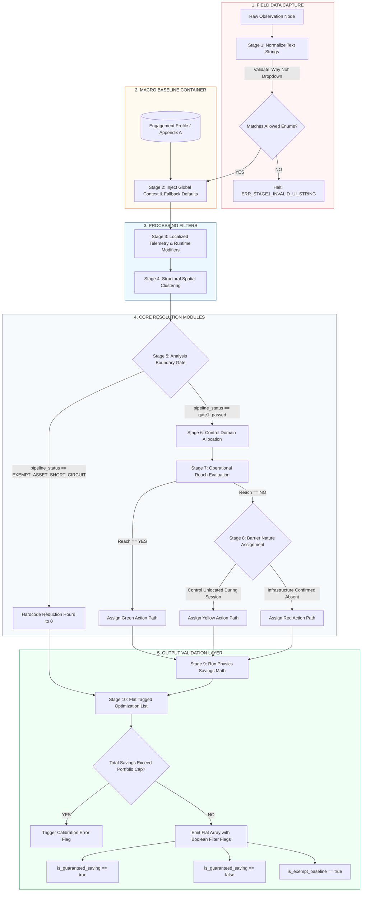

# Inference Engine Technical Specification (v3.1 Production)

## SECTION 1 — Executive System Overview

### 1.1 — Functional Role
The Inference Engine is the deterministic, server-side processing core responsible for transforming raw environmental observations into verified, audit-ready energy optimization measures. It serves as the single source of truth for calculations, risk token attribution, and portfolio financial modeling.

### 1.2 — System Decoupling (Frontend vs. Backend Contract)
To maintain structural agility and prevent logic fragmentation, the system enforces a strict architectural boundary between data acquisition and data processing:

* **The Discovery Studio (Frontend):** The mobile and web wireframes function purely as stateless capture mechanisms. The frontend UI is completely blind to savings math, asset wattages, utility structures, or routing topology. Its sole responsibility is to capture field states, validate user inputs against basic data types, and ship flat data structures.
* **The Inference Engine (Backend):** The engine functions as an isolated, deterministic state machine. It consumes the raw payload, injects global constraints, runs the physics modeling loops, and distributes results.


### 1.3 — Operational Boundaries
The engine does not utilize machine learning, predictive heuristics, or stochastic estimation. Every output state is a direct, traceable function of its inputs and fixed engineering constants. If the engine encounters an incomplete data state that cannot be resolved through predefined fallback rules, it is structurally mandated to halt processing for that node rather than generate an assumed value.

---

## SECTION 2 — Core Design Principles

To ensure absolute audit integrity and predictability across large asset portfolios, the Inference Engine must strictly adhere to the following architectural design principles:

### 2.1 — Zero Implicit Inference
The engine operates on a mandate of complete explicit verification. If data is absent, ambiguous, or un-mapped across onboarding databases or field payloads, the system is strictly prohibited from executing any of the following:
* Applying statistical averages or "most likely" defaults.
* Utilizing historical trends to fill missing telemetry or structural metrics.
* Inferring control layers based on asset types (e.g., assuming a light fixture is on a timer simply because it is located in a retail zone).

If a value is missing or unverified, the engine flags the record as `FLAGGED` and halts downstream math calculations for that node unless a centralized, auditable system baseline fallback rule is explicitly declared.

### 2.2 — Fail-Fast Pipeline Isolation
Data errors must never propagate down the pipeline. The sequence enforces a hard "validate-before-transform" gate at every stage interface. 
* Any data node that triggers a validation error code (e.g., `ERR_STAGE1_INVALID_UI_STRING`) immediately halts execution along its path.
* The engine isolates the invalid cluster or observation node, logs the precise failure signature, and allows valid clusters to continue unimpeded. 
* This prevents a single corrupt field entry from invalidating an entire building or portfolio processing run.

### 2.3 — Immutable Data Lineage
Data transformation throughout the 10 stages is entirely additive. The engine is structurally forbidden from overwriting raw incoming field data or early-stage context metadata. 
* As a payload advances through successive stages, the engine appends nested telemetry filters, capability arrays, and physics calculations into isolated wrapper objects. 
* This guarantees a transparent, deterministic audit trail from the ultimate dollar savings pool in Stage 10 back to the exact physical observation row captured by the field surveyor.

---

## SECTION 3 — Global Data Schemas

To ensure strict validation and execution, the Inference Engine requires all incoming payloads to conform to a standardized schema layout. This section details the data shape required for a raw observation package prior to pipeline ingestion.

### 3.1 — Raw Field Observation Contract
The basic unit of data injected into the engine from the field discovery interface is the `ObservationNode`. This schema defines the mandatory parameters required to execute Stage 1 validation.

```json
{
  "$schema": "[https://json-schema.org/draft/2020-12/schema](https://json-schema.org/draft/2020-12/schema)",
  "title": "ObservationNode",
  "type": "object",
  "properties": {
    "observation_id": {
      "type": "string",
      "description": "Unique, immutable UUID generated by the field device for tracking lineage."
    },
    "space_id": {
      "type": "string",
      "description": "Alpha-numeric identifier matching the master facility space directory."
    },
    "asset_sub_class": {
      "type": "string",
      "description": "Specific equipment classification taxonomy key used for physics math constants."
    },
    "field_count": {
      "type": "integer",
      "minimum": 1,
      "description": "Physical tally of active fixtures under this precise condition set."
    },
    "did_you_turn_off": {
      "type": "string",
      "enum": ["YES", "NO"],
      "description": "Primary behavioral gate recording surveyor physical interaction."
    },
    "why_not_enum": {
      "type": ["string", "null"],
      "enum": [
        "No Switch Present",
        "Requires Permission",
        "Occupancy Sensor",
        "Timer / Schedule",
        "Control Not Found",
        "Other",
        null
      ],
      "description": "Mandatory conditional drop-down response string required if did_you_turn_off is NO. Must be null if did_you_turn_off is YES."
    }
  },
  "required": [
    "observation_id",
    "space_id",
    "asset_sub_class",
    "field_count",
    "did_you_turn_off",
    "why_not_enum"
  ]
}
```

### 3.2 — Validation Constraint Logic
* **Conditional Enforcement Rule:** While `why_not_enum` allows a null type, the API gateway evaluation layer dictates that if `did_you_turn_off == "NO"`, a non-null string match from the allowed array must be present. If `why_not_enum` arrives as null while `did_you_turn_off == "NO"`, processing fails the schema contract and drops before entering Stage 1.
* **Taxonomy Alignment:** The `asset_sub_class` value must match the global engineering dictionary exactly. Case sensitivity is strictly enforced (e.g., `"LIGHTING_DISPLAY_ACCENT"` is valid; `"Lighting_Display_Accent"` will trigger an instant type-match termination).

---

## SECTION 4 — 10-STAGE PIPELINE

The Inference Engine processes observations through a rigid 10-stage sequential pipeline. No stage may be bypassed. Observations must complete each stage in order before advancing.

1. **STAGE 1** — Ingestion and Normalization
2. **STAGE 2** — Global Portfolio Context (Macro Baseline Container)
3. **STAGE 3** — Localized Telemetry Context & Runtime Modification
4. **STAGE 4** — Structural Spatial Clustering
5. **STAGE 5** — Asset Capability Resolution (Analysis Boundary Gate)
6. **STAGE 6** — Control Domain Allocation
7. **STAGE 7** — Operational Reach Evaluation
8. **STAGE 8** — Barrier Nature Assignment
9. **STAGE 9** — Measure Generation and Savings Calculation
10. **STAGE 10** — Flat Tagged Optimization List and Macro Validation

### 4.1 — Pipeline Logic Schematic

Below is the technical visualization of the 10-stage backend pipeline execution paths:



---

## SECTION 5 — STAGE SPECIFICATIONS

### 5.1 — STAGE 1: Ingestion and Normalization

#### 5.1.1 — Purpose
To ingest raw field observations from the mobile discovery interface, validate payload parameters, and normalize arbitrary text entries into strict system enums. If input verification fails, processing halts immediately before affecting data state.

#### 5.1.2 — UI Dropdown Field Enforcements ("Why Not" Rule-Couplet)
When a field observation record indicates that an asset was not deactivated by the surveyor (`did_you_turn_off == "NO"`), the ingestion API contract enforces an exact text string match against one of six allowed values.

```json
{
  "type": "object",
  "properties": {
    "did_you_turn_off": { "type": "string", "enum": ["YES", "NO"] },
    "why_not_enum": {
      "type": "string",
      "enum": [
        "No Switch Present",
        "Requires Permission",
        "Occupancy Sensor",
        "Timer / Schedule",
        "Control Not Found",
        "Other"
      ]
    }
  },
  "required": ["did_you_turn_off"]
}
```

#### 5.1.3 — Programmatic Routing Paths
The inference engine executes a deterministic data-routing sequence strictly bounded by the validated `why_not_enum` values:

1. **"No Switch Present"**
   * **Target Route:** STAGE 6 — Control Domain Allocation
   * **Action:** Bypasses manual occupant routing; forces classification to a centralized circuit-level panel distribution loop.
2. **"Requires Permission"**
   * **Target Route:** STAGE 5 — Asset Capability Resolution
   * **Action:** Functions strictly as an assessment domain signal and credential gap. It routes to Stage 5 for capability mapping context rather than triggering an auto-zero or automated short-circuit calculation.
3. **"Occupancy Sensor"**
   * **Target Route:** STAGE 3 — Localized Telemetry Context & Runtime Modification
   * **Action:** Identifies a localized hardware sweep control and routes to Stage 3 to apply an automated runtime modifier adjustment.
4. **"Timer / Schedule"**
   * **Target Route:** STAGE 6 — Control Domain Allocation
   * **Action:** Links asset domain metrics directly to a mechanical timeclock or automated building automation schedule profile.
5. **"Control Not Found"**
   * **Target Route:** STAGE 7 — Operational Reach Evaluation
   * **Action:** Triggers the P7 Default operational visibility restriction rule, forcing immediate reach evaluation metrics to `"NO"` and advancing the packet to Stage 8.
6. **"Other"**
   * **Target Route:** STAGE 10 — Flat Tagged Optimization List and Macro Validation
   * **Action:** Categorizes the record as an unresolved outlier anomaly. Affixes an immutable flag forcing a manual engineering review before report compilation, isolating it completely from automated saving algorithms.

---

### 5.2 — STAGE 2: Global Portfolio Context (Macro Baseline Container)

#### 5.2.1 — Purpose
To inject macro-environmental boundaries, localized utility rate structures, and pre-onboarded infrastructure baseline data into the validated observation stream. This stage executes a database-join cascade to reconcile drawings with field states, falling back to auditable default parameters if site documentation is incomplete.

#### 5.2.2 — Input Requirements
This stage accepts the validated JSON payload from Stage 1 and maps it against two static relational tables initialized during project onboarding:
1. **Table A: Pre-Onboarding Infrastructure Baseline** (As-built engineering drawings, panel schedules, and BMS sequences).
2. **Table B: Facilitator Site Walk Overrides** (Populated via the validation card interface).
3. **Appendix A: Centralized Control Assumption Defaults Matrix** (System-level fallback values based on taxonomy).

#### 5.2.3 — Ingestion Logic Hierarchy (The Cascade Rule)
To resolve the infrastructure context properties while ensuring the pipeline can proceed with progress calculations without throwing structural compilation errors, the engine executes a strict, top-down fallback cascade:

```text
Step 1: Query Table B for an active "Facilitator Override" matching the target space_id + asset_sub_class.
        ├── IF FOUND: Set resolved_control_domain = observed_control_enum.
        │             Set is_default_applied = false. Proceed to Stage 3.
        └── IF NOT FOUND: Proceed to Step 2.

Step 2: Query Table A for a "Pre-Onboarding Baseline" matching the target space_id + asset_sub_class.
        ├── IF FOUND: Set resolved_control_domain = doc_control_enum.
        │             Set is_default_applied = false. Proceed to Stage 3.
        └── IF NOT FOUND: Proceed to Step 3.

Step 3: Query Appendix A for a Centralized Control Default matching the target asset_sub_class taxonomy.
        ├── IF FOUND: Set resolved_control_domain = fallback_control_enum.
        │             Set is_default_applied = true.
        │             Set validation_status = "CLEARED_WITH_DEFAULTS". Proceed to Stage 3.
        └── IF NOT FOUND: Proceed to Step 4 (Ultimate Global Catch-All).

Step 4: Execute Ultimate Global Catch-All Rule for unclassified/unknown assets.
        ├── Action: Set resolved_control_domain = "LOCAL_MANUAL_SWITCH".
        │           Set is_default_applied = true.
        │           Set source_documentation_ref = "GLOBAL_CATCH_ALL_FALLBACK".
        │           Set validation_status = "RECONCILIATION_REQUIRED".
        └── Result: Payload clears Stage 2 with 100% throughput. Proceed to Stage 3.
```

#### 5.2.4 — Output Schema (Context-Injected Node)
Successful execution outputs an augmented data packet containing local field counts, global constraints, and default tracking trackers:
```json
{
  "space_id": "NR-1101",
  "asset_sub_class": "LIGHTING_DISPLAY_ACCENT",
  "field_count": 14,
  "global_context": {
    "blended_utility_rate_kwh": 0.318,
    "portfolio_spend_cap_kwh": 2400000,
    "resolved_control_domain": "LOCAL_MANUAL_SWITCH",
    "associated_panel_id": "BMS-P3-ZONE2",
    "source_documentation_ref": "APPENDIX_A_FALLBACK",
    "is_default_applied": true
  },
  "validation_status": "CLEARED_WITH_DEFAULTS"
}
```

---

### 5.3 — STAGE 3: Localized Telemetry Context & Runtime Modification

#### 5.3.1 — Purpose
To apply real-time telemetry inputs alongside localized environmental control observations to modify confidence scores and operating hours assumptions. This stage explicitly separates continuous external telemetry tracking from discrete, control-driven runtime modifiers before individual observations undergo spatial clustering.

#### 5.3.2 — Input Requirements
This stage accepts the context-injected payload from Stage 2 and evaluates active occupant/worker signals alongside field-recorded hardware sensor behaviors.

#### 5.3.3 — Processing and Filter Rules
The presence of local automated hardware or real-time presence signals alters baseline operational assumptions. The engine applies these evaluations in a single sequential pass:

1. **Live Telemetry Context Filters (Owls & Bulldogs):**
   * **Owl Processing:** If `owl_count` > 0 for a room, reduce the confidence score for illicit-load findings (default: -0.20 per Owl observed) and apply an hours adjustment to `H_reduction` based on irregular after-hours presence frequency. Context signals modify assumptions; they do not suppress findings.
   * **Bulldog Processing:** Evaluates non-occupant workers by role type (Security, Cleaning, Contractor, Unknown) to apply time-bound confidence reductions to affected floors or zones during their active influence windows without deleting findings.
2. **Control-Based Runtime Modifiers (Occupancy Sensors):**
   * If `why_not_enum == "Occupancy Sensor"`, the engine recognizes that an automated local hardware sweep control is active rather than a continuous live tracking stream. It queries the system database for the site's verified sensor timeout sweep constant ($F_{\text{telemetry}}$).
   * If the constant is present, it is mapped to the asset node as `telemetry_decay_factor` to scale the downstream potential waste-runtime window (e.g., a constant of `0.75` accounting for a 25% reduction in unmanaged runtime due to integrated sensor cycling).
   * If the sensor constant is missing from the portfolio database configuration, the engine is prohibited from assuming an arbitrary default value. Set `telemetry_decay_factor = null`, mark `validation_status = "FLAGGED"`, log `ERR_STAGE3_MISSING_SENSOR_CONSTANT`, and terminate processing.
3. **Standard Baseline Default Rule:**
   * For observations where `why_not_enum` does not equal `"Occupancy Sensor"`, no automated runtime adjustments are applied at this layer. Set `telemetry_decay_factor = 1.0` and preserve the default unmanaged waste hour constant asset assumptions intact.

#### 5.3.4 — Output Schema (Telemetry-Filtered Node)
Successful execution appends the computed runtime modifier value directly to the tracking metadata wrapper:
```json
{
  "space_id": "NR-1101",
  "asset_sub_class": "LIGHTING_DISPLAY_ACCENT",
  "field_count": 14,
  "global_context": {
    "blended_utility_rate_kwh": 0.318,
    "portfolio_spend_cap_kwh": 2400000,
    "resolved_control_domain": "LOCAL_MANUAL_SWITCH",
    "associated_panel_id": "BMS-P3-ZONE2",
    "source_documentation_ref": "APPENDIX_A_FALLBACK",
    "is_default_applied": true
  },
  "telemetry_filter": {
    "telemetry_decay_factor": 1.0,
    "applied_signal_source": "standard_baseline_default"
  },
  "validation_status": "CLEARED_WITH_DEFAULTS"
}
```

---

### 5.4 — STAGE 4: Structural Spatial Clustering

#### 5.4.1 — Purpose
To execute data array compression by grouping individual observation rows into unified spatial system clusters. The engine aggregates data to eliminate duplicate computation loops while preserving unique lineage back to the raw field entries.

#### 5.4.2 — Input Requirements
This stage accepts a stream or array of individual telemetry-filtered nodes from Stage 3.

#### 5.4.3 — Clustering Mechanics & Boundary Rules
The clustering loop is completely deterministic and operates on a strict composite key constraint. It executes according to the following mathematical grouping logic:

1. **The Composite Key Enforcer:**
   * Observations are grouped if and only if they share an identical **`space_id`** AND an identical **`asset_sub_class`**.
   * If two observations share the same `space_id` but have different `asset_sub_class` taxonomies, they must be split into separate system clusters.
   * Cross-room or cross-zone spatial blending is strictly prohibited.
2. **Aggregation Agglomeration:**
   * For matching nodes, the totalized count ($C_{\text{cluster}}$) is calculated as the sum of all individual field counts:
     $$C_{\text{cluster}} = \sum_{i=1}^{n} C_i$$
   * Where $C_i$ represents the individual `field_count` value for node $i$.
   * Individual `observation_id` string flags are aggregated into a flat tracking array (`source_observation_ids`) to preserve data lineage for downstream audits.
3. **Context Reconciliation:**
   * If any matching observations contain conflicting `global_context` attributes (e.g., mismatched panel IDs for the same asset class in the same room), the engine cannot select an average or a majority. Execution halts instantly, flagging the entire spatial group as `FLAGGED` with error code `ERR_STAGE4_SPATIAL_CONTEXT_CONFLICT`.

#### 5.4.4 — Output Schema (Unified Cluster Object)
Successful execution reduces the stream size, handing off a structured array of unique system clusters:
```json
[
  {
    "cluster_id": "cluster_nr_1101_lighting_display_accent",
    "space_id": "NR-1101",
    "asset_sub_class": "LIGHTING_DISPLAY_ACCENT",
    "total_cluster_count": 14,
    "source_observation_ids": ["raw_83", "raw_104"],
    "aggregated_context": {
      "blended_utility_rate_kwh": 0.318,
      "portfolio_spend_cap_kwh": 2400000,
      "resolved_control_domain": "LOCAL_MANUAL_SWITCH",
      "associated_panel_id": "BMS-P3-ZONE2",
      "telemetry_decay_factor": 1.0,
      "is_default_applied": true
    },
    "validation_status": "CLEARED_WITH_DEFAULTS"
  }
]
```

---

### 5.5 — STAGE 5: Asset Capability Resolution (Analysis Boundary Gate)

#### 5.5.1 — Purpose
To execute Gate 1 of the Performance Map classification logic and determine whether an asset is physically capable of supporting a correction in its current state, while validating verified administrative scope limits via the Exemption Gate.

#### 5.5.2 — Input Requirements
This stage accepts the unified spatial cluster arrays from Stage 4 and evaluates asset condition parameters alongside the active session's administrative boundary configurations.

#### 5.5.3 — Resolution Sequence & The Exemption Gate
The engine is strictly prohibited from inferring continuous baseline states or mechanical capacity constraints from surveyor operational session limitations like `why_not_enum == "Requires Permission"`. This response indicates a boundary domain signal and a surveyor credential gap, not a structural baseload indicator. The engine executes checks on each cluster in the following order:

1. **The Exemption Gate:**
   * The engine scans for an explicit `capability_code == "EXEMPT_ASSET"`, initialized exclusively by explicit Facilitator confirmation at the Analysis Boundary Gate (never by automated text matching in Stage 1).
   * **Action:** Hardcode operational runtime reduction hours to zero ($H_{\text{reduction}} = 0$) and map the node explicitly as an exempt baseline record within the flat array payload. Set `pipeline_status = "EXEMPT_ASSET_SHORT_CIRCUIT"`. The cluster completely bypasses downstream domain allocation, reach, and barrier analysis loops (Stages 6, 7, and 8) and routes directly to Stage 9 and 10 for metadata preservation.
2. **Gate 1 Asset Capability Check:**
   * If `condition_enum == "DAMAGED"` or the field state indicates a structural hardware failure (e.g., control board fried, system locked ON), the node terminates at Gate 1. Set `assigned_domain = "Mechanical"`, `assigned_action_path = "Red"`, and advance directly to Stage 9 for replacement math calculations.
3. **Standard Status Advancement:**
   * If the cluster does not carry an explicit `EXEMPT_ASSET` or `DAMAGED` restriction, set `pipeline_status = "gate1_passed"` and advance the cluster intact to Stage 6.

#### 5.5.4 — Output Schema (Capability-Resolved Object)
Example of an asset cluster packet that has triggered the exempt baseline short-circuit path:
```json
{
  "cluster_id": "cluster_nr_1101_lighting_display_accent",
  "space_id": "NR-1101",
  "asset_sub_class": "LIGHTING_DISPLAY_ACCENT",
  "total_cluster_count": 14,
  "source_observation_ids": ["raw_83", "raw_104"],
  "aggregated_context": {
    "blended_utility_rate_kwh": 0.318,
    "portfolio_spend_cap_kwh": 2400000,
    "resolved_control_domain": "LOCAL_MANUAL_SWITCH",
    "associated_panel_id": "BMS-P3-ZONE2",
    "telemetry_decay_factor": 1.0,
    "is_default_applied": true
  },
  "capability_resolution": {
    "pipeline_status": "EXEMPT_ASSET_SHORT_CIRCUIT",
    "capability_code": "EXEMPT_ASSET",
    "forced_hours_reduction": 0,
    "bypass_engineering_gates": true
  },
  "validation_status": "CLEARED_WITH_DEFAULTS"
}
```

---

### 5.6 — STAGE 6: Control Domain Allocation

#### 5.6.1 — Purpose
To categorize and map the exact mechanical, electrical, or behavioral control vector governing the equipment cluster. This stage establishes the structural boundaries of where a control intervention must physically take place (e.g., at the local wall plate versus a centralized breaker panel).

#### 5.6.2 — Input Requirements
This stage accepts equipment clusters that successfully cleared the Stage 5 capability gateway and carry an active `pipeline_status == "gate1_passed"`.

#### 5.6.3 — Allocation & Weighting Logic
The engine evaluates the cluster's context and the validated `why_not_enum` state to explicitly assign a `control_domain_type`. No assumptions are permitted; any unmapped infrastructure links force an immediate processing halt.

1. **"No Switch Present" Mapping Rule:**
   * If `why_not_enum == "No Switch Present"`, the engine overrides any local occupant assumptions and binds the cluster to a branch circuit panel topology.
   * Set `control_domain_type = "CENTRAL_PANEL_LOOP"`.
   * The engine checks for a valid `associated_panel_id` injected during Stage 2. If the field is `null`, it trips `ERR_STAGE6_MISSING_PANEL_TOPOLOGY`, flags the cluster, and halts.
2. **"Timer / Schedule" Mapping Rule:**
   * If `why_not_enum == "Timer / Schedule"`, the engine binds the control logic to centralized automation frameworks.
   * Set `control_domain_type = "AUTOMATED_SCHEDULE"`.
3. **"YES" (Turned Off) Mapping Rule:**
   * If the underlying observation records resolved to `did_you_turn_off == "YES"`, the control vector is occupant-dependent.
   * Set `control_domain_type = "LOCAL_MANUAL_SWITCH"`.
4. **Fallback Default Resolution Allocation Rule:**
   * If the domain was populated by the Stage 2 Fallback Default Engine (`is_default_applied == true`) and `why_not_enum` is not overridden by specific rules 1-3, the engine maps the allocated control domain value directly to its matching taxonomy type.
   * Set `control_domain_type = resolved_control_domain`.
5. **Missing Infrastructure Check:**
   * If a cluster arrives with an unpopulated `resolved_control_domain` from Stage 2 and cannot be resolved by these rules, the engine sets `control_domain_type = null`, marks `validation_status = "FLAGGED"`, appends `ERR_STAGE6_CONTROL_DOMAIN_UNRESOLVED`, and terminates the execution path.

#### 5.6.4 — Output Schema (Control-Allocated Object)
Successful execution updates the cluster with its verified physical control boundaries:
```json
{
  "cluster_id": "cluster_nr_1101_lighting_display_accent",
  "space_id": "NR-1101",
  "asset_sub_class": "LIGHTING_DISPLAY_ACCENT",
  "total_cluster_count": 14,
  "source_observation_ids": ["raw_83", "raw_104"],
  "aggregated_context": {
    "blended_utility_rate_kwh": 0.318,
    "portfolio_spend_cap_kwh": 2400000,
    "associated_panel_id": "BMS-P3-ZONE2",
    "telemetry_decay_factor": 1.0,
    "is_default_applied": true
  },
  "capability_resolution": {
    "pipeline_status": "gate1_passed",
    "capability_code": "FUNCTIONAL_OPTIMIZABLE"
  },
  "control_allocation": {
    "control_domain_type": "LOCAL_MANUAL_SWITCH",
    "control_layer_validated": true
  },
  "validation_status": "CLEARED_WITH_DEFAULTS"
}
```

---

### 5.7 — STAGE 7: Operational Reach Evaluation

#### 5.7.1 — Purpose
To evaluate whether the operating entity possesses the contractual, legal, or logistical authority—termed "operational reach"—to execute an intervention on the allocated control domain. This stage separates easily accessible changes from those blocked by organizational boundaries.

#### 5.7.2 — Input Requirements
This stage accepts equipment clusters that successfully completed Stage 6 (`control_layer_validated == true`).

#### 5.7.3 — Reach Evaluation & The P7 Default Rule
The engine checks organizational authorization logs and the field data to resolve the `operational_reach_status`. Implicit assumptions are strictly forbidden.

1. **The P7 Default Rule ("Control Not Found"):**
   * If the cluster contains any underlying field observation records where `why_not_enum == "Control Not Found"`, the engine triggers the **P7 Default Rule** regardless of whether Stage 2 injected a progress calculation control fallback.
   * **The Logic:** Because the physical control mechanism could not be located by the field team during discovery, the client possesses no immediate operational visibility or reach over the asset for that session.
   * **Action:** Force `operational_reach_status = "NO"`. The cluster is strictly barred from advancing directly to a green pathway and is routed immediately to **STAGE 8 — Barrier Nature Assignment** to track remediation.
2. **Standard Reach Validation:**
   * If `why_not_enum` does not contain "Control Not Found", the engine queries the site's vendor contract database for the allocated `control_domain_type` (resolved in Stage 6).
   * **Reach == YES:** If the contract profiles show the client has in-house maintenance authority or an active service contract to alter the control loop, set `operational_reach_status = "YES"`. The cluster skips Stage 8, sets `assigned_action_path = "Green"`, and maps directly to Stage 9.
   * **Reach == NO:** If the control loop belongs to an uncooperative landlord, a third-party base-building system, or a vendor with an `UNKNOWN` relationship status, set `operational_reach_status = "NO"` and route the cluster to Stage 8.

#### 5.7.4 — Output Schema (Reach-Evaluated Object)
```json
{
  "cluster_id": "cluster_nr_1101_lighting_display_accent",
  "space_id": "NR-1101",
  "asset_sub_class": "LIGHTING_DISPLAY_ACCENT",
  "total_cluster_count": 14,
  "source_observation_ids": ["raw_83", "raw_104"],
  "control_allocation": {
    "control_domain_type": "LOCAL_MANUAL_SWITCH",
    "control_layer_validated": true
  },
  "operational_reach": {
    "operational_reach_status": "NO",
    "reach_evaluation_code": "P7_RULE_CONTROL_NOT_FOUND",
    "skip_barrier_analysis": false
  },
  "validation_status": "CLEARED_WITH_DEFAULTS"
}
```

---

### 5.8 — STAGE 8: Barrier Nature Assignment

#### 5.8.1 — Purpose
To execute Gate 4 of the Performance Map classification logic, differentiating Yellow from Red action paths for finding clusters that failed the Stage 7 operational reach evaluation.

#### 5.8.2 — Input Requirements
This stage processes capable equipment clusters where `operational_reach_status == "NO"`.

#### 5.8.3 — Barrier Classification Tree (Gate 4 Branching)
The engine is prohibited from auto-assigning a structural capital deficiency on the field observation string `why_not_enum == "Control Not Found"`. A missing control during a session indicates a localized visibility limitation and must branch dynamically based on post-session engineering investigation criteria:

1. **Red Pathway Token (Structural / Capital Barriers):**
   * **Criteria:** The optimization is blocked by an absolute absence of physical infrastructure, hidden distribution routing, or hard real estate boundaries. Resolution requires hardware procurement, new vendor engagement, or capital expenditure.
   * **Trigger Conditions:** The `why_not_enum` value resolves to `"Control Not Found"`, AND a post-session engineering review explicitly verifies that the physical control infrastructure is absent and requires capital installation.
   * **Action:** Assign `assigned_action_path = "Red"`. Set the operational category wrapper to `STRUCTURAL_INFRASTRUCTURE_BARRIER`.
2. **Yellow Pathway Token (Operational / Logic / Coordination Barriers):**
   * **Criteria:** The optimization block is administrative, programmatic, or a coordination gap. Resolution requires logic reconfiguration, layout tracing, or tenant-coordination loops without capital hardware procurement.
   * **Trigger Conditions:**
     * `why_not_enum == "Timer / Schedule"`
     * `why_not_enum == "No Switch Present"` (where branch control loops exist at a panel circuit level but require administrative coordination).
     * The `why_not_enum` value resolves to `"Control Not Found"`, but post-session engineering default review confirms the control loop physically exists and was simply unlocated by the surveyor during the session.
   * **Action:** Assign `assigned_action_path = "Yellow"`. Set the operational category wrapper to `LOGIC_CONFIGURATION_BARRIER`.

#### 5.8.4 — Output Schema (Barrier-Assigned Object)
```json
{
  "cluster_id": "cluster_nr_1101_lighting_display_accent",
  "space_id": "NR-1101",
  "asset_sub_class": "LIGHTING_DISPLAY_ACCENT",
  "control_allocation": {
    "control_domain_type": "LOCAL_MANUAL_SWITCH"
  },
  "operational_reach": {
    "operational_reach_status": "NO",
    "reach_evaluation_code": "P7_RULE_CONTROL_NOT_FOUND"
  },
  "barrier_assignment": {
    "assigned_action_path": "Yellow",
    "barrier_operational_category": "LOGIC_CONFIGURATION_BARRIER",
    "engineering_override_required": true
  },
  "validation_status": "CLEARED_WITH_DEFAULTS"
}
```

---

### 5.9 — STAGE 9: Measure Generation and Savings Calculation

#### 5.9.1 — Purpose
To run the deterministic engineering physics core. This stage calculates the baseline power load, annual unmanaged waste run-time hours, net energy reduction, and financial impacts of the proposed intervention. All equations are strictly bounded by asset taxonomy constants and the telemetry decay values assigned upstream.

#### 5.9.2 — Input Requirements
This stage accepts all processed equipment clusters. This includes active optimization candidates (Green, Yellow, and Red paths) and short-circuited baseline entries.

#### 5.9.3 — Physics Calculations & Deterministic Formulas
The engine runs a four-step calculation sequence using fixed constants mapped to the specific `asset_sub_class`. No historical averaging or statistical smoothing is permitted.

##### Step 1: Connected Cluster Load ($P_{\text{load}}$)
The total electrical load for the system cluster is calculated by multiplying the aggregated count by the baseline fixture wattage constant ($W_{\text{fixture}}$) defined in the system asset catalog:
$$P_{\text{load}} = (C_{\text{cluster}} \times W_{\text{fixture}}) \times 10^{-3}$$

* $P_{\text{load}}$ = Total connected cluster load in kilowatts (kW).
* $C_{\text{cluster}}$ = Total item count (`total_cluster_count`).
* $W_{\text{fixture}}$ = Sub-class equipment baseline wattage (e.g., $50\text{W}$ for Halogen Track, $15\text{W}$ for LED Can).

##### Step 2: Realized Operational Hours Reduction ($H_{\text{reduction}}$)
The engine computes the potential waste-hour compression window.
* If the asset was short-circuited as an operational baseline (`pipeline_status == "EXEMPT_ASSET_SHORT_CIRCUIT"` or `capability_code == "EXEMPT_ASSET"`), the reduction hours are locked:
  $$H_{\text{reduction}} = 0$$
* For optimizable paths, the engine reads the default sub-class unmanaged waste hour constant ($H_{\text{waste}}$) and scales it by the computed telemetry decay multiplier variable ($F_{\text{telemetry}}$):
  $$H_{\text{reduction}} = H_{\text{waste}} \times F_{\text{telemetry}}$$

* $H_{\text{reduction}}$ = Realized annual hours reduction.
* $H_{\text{waste}}$ = Default sub-class unmanaged waste hour constant.
* $F_{\text{telemetry}}$ = Telemetry decay factor variable derived from `telemetry_decay_factor`.

##### Step 3: Annualized Energy Savings ($E_{\text{savings}}$)
Net electrical consumption reduction is calculated as a direct product of load and time:
$$E_{\text{savings}} = P_{\text{load}} \times H_{\text{reduction}}$$

* $E_{\text{savings}}$ = Annualized energy savings in kilowatt-hours (kWh).

##### Step 4: Financial Savings Generation ($S_{\text{financial}}$)
The ultimate localized fiscal impact uses the specific blended rate ($R_{\text{utility}}$) injected during Stage 2:
$$S_{\text{financial}} = E_{\text{savings}} \times R_{\text{utility}}$$

* $S_{\text{financial}}$ = Realized annual cost reduction in gross USD.
* $R_{\text{utility}}$ = Localized blended utility rate (`blended_utility_rate_kwh`).

#### 5.9.4 — Output Schema (Calculated Savings Object)
```json
{
  "cluster_id": "cluster_nr_1101_lighting_display_accent",
  "space_id": "NR-1101",
  "asset_sub_class": "LIGHTING_DISPLAY_ACCENT",
  "capability_resolution": {
    "pipeline_status": "gate1_passed",
    "capability_code": "FUNCTIONAL_OPTIMIZABLE"
  },
  "barrier_assignment": {
    "assigned_action_path": "Yellow",
    "barrier_operational_category": "LOGIC_CONFIGURATION_BARRIER"
  },
  "physics_calculations": {
    "calculated_p_load_kw": 0.70,
    "calculated_h_reduction": 3500.0,
    "annual_energy_savings_kwh": 2450.0,
    "annual_financial_savings_usd": 779.10,
    "math_execution_verified": true
  },
  "validation_status": "CLEARED_WITH_DEFAULTS"
}
```

---

### 5.10 — STAGE 10: Flat Tagged Optimization List and Macro Validation

#### 5.10.1 — Purpose
To validate aggregate outputs against macro portfolio limits and stamp individual rows with explicit, machine-readable boolean flags based on contractual limits. This enables downstream dashboards and mobile software modules to run real-time contract progress tracking on a flat array payload without system fragmentation.

#### 5.10.2 — Ingestion Boundary Flagging Constraints
The engine is structurally forbidden from dividing clusters into separate nested data arrays. It outputs a single flat list of processed entries. Every node in the array is dynamically evaluated and stamped with boolean identifiers using mathematical thresholds:

1. **Portfolio Consumption Cap Check:**
   * The aggregate sum of all calculated finding savings cannot mathematically exceed the facility baseline bounds loaded in Stage 2.
   * If the totalized savings exceed the master portfolio limit defined by the `portfolio_spend_cap_kwh` attribute, trigger a baseline calibration error, log `ERR_STAGE10_PORTFOLIO_CAP_EXCEEDED`, and block payload distribution:
     $$\sum E_{\text{savings}} > P_{\text{cap}}$$
2. **Contractual Significance Flagging Rule (`is_guaranteed_saving`):**
   * The engine reads the contract significance limit loaded in the active session's administrative parameters (`guarantee_significance_floor_kwh`).
   * If a cluster's computed annual energy savings meet or exceed that floor threshold, stamp the node true; otherwise, false. Color path tokens have zero structural influence on this rule:
     $$E_{\text{savings}} \ge E_{\text{floor}}$$
3. **Exempt Baseline Tracking Rule (`is_exempt_baseline`):**
   * If a cluster was diverted at Stage 5 as a non-optimizable permanent baseline asset, stamp the node true; otherwise, false.
     ```text
     IF pipeline_status == "EXEMPT_ASSET_SHORT_CIRCUIT" OR capability_code == "EXEMPT_ASSET":
         SET is_exempt_baseline = true
     ELSE:
         SET is_exempt_baseline = false
     ```
4. **The "Other" Isolation Exception Bucket:**
   * Nodes flagged as `"Other"` in Stage 1 are completely intercepted and stripped from automated field calculation logs. The engine assigns a `FACILITATOR_REVIEW_REQUIRED` validation state tag and routes the raw record to the isolated anomaly block for manual engineering reconciliation.

#### 5.10.3 — Output Schema (Master Flat Tagged Data Package)
Successful execution outputs a flat array of calculated measures stamped with tracking metrics:
```json
{
  "portfolio_run_id": "run_2026_05_north_wing",
  "execution_timestamp": "2026-05-23T15:13:30Z",
  "portfolio_validation": {
    "total_calculated_savings_kwh": 2600.0,
    "portfolio_spend_cap_kwh": 2400000.0,
    "boundary_check_passed": true
  },
  "calculated_findings_pool": [
    {
      "cluster_id": "cluster_nr_1101_lighting_display_accent",
      "space_id": "NR-1101",
      "asset_sub_class": "LIGHTING_DISPLAY_ACCENT",
      "assigned_action_path": "Yellow",
      "annual_energy_savings_kwh": 2450.0,
      "annual_financial_savings_usd": 779.10,
      "is_default_applied": true,
      "is_guaranteed_saving": true,
      "is_exempt_baseline": false
    },
    {
      "cluster_id": "cluster_nr_1101_lighting_recessed_can",
      "space_id": "NR-1101",
      "asset_sub_class": "LIGHTING_RECESSED_CAN",
      "assigned_action_path": "Green",
      "annual_energy_savings_kwh": 150.0,
      "annual_financial_savings_usd": 47.70,
      "is_default_applied": false,
      "is_guaranteed_saving": false,
      "is_exempt_baseline": false
    }
  ],
  "isolated_review_bucket": []
}
```

---

## SECTION 6 — Centralized Data Dictionary & Taxonomy

This section serves as the single source of truth for all naming conventions, data schemas, internal state variables, and enum matrices utilized by the Inference Engine. All code implementations must adhere strictly to these exact string keys, data types, and case rules.

### 6.1 — Core Entity Attributes (Field Capture Input Layer)
These parameters originate directly from the frontend Discovery Studio UI as flat payload elements. They represent the un-mutated field state raw telemetry.

| Parameter Key | Data Type | Permitted Values / Pattern | Origin / Owner | Technical Definition |
| :--- | :--- | :--- | :--- | :--- |
| `observation_id` | String | Strict UUIDv4 Format | Frontend UI | Unique, immutable identifier generated by the client device per field entry to preserve data lineage. |
| `space_id` | String | Alpha-numeric key string | Frontend UI / Facility Map | Structural identifier mapping the observation row directly to a row in the master site facility directory. |
| `asset_sub_class` | String | Upper-case snake_case string matrix | Frontend UI / Asset Dictionary | Categorization key pointing to exact engineering equipment profiles (e.g., `"LIGHTING_DISPLAY_ACCENT"`, `"LIGHTING_RECESSED_CAN"`). |
| `field_count` | Integer | $\ge 1$ | Frontend UI | The physical unit tally of active fixtures observed operating under identical environmental conditions. |
| `did_you_turn_off` | String | `"YES"`, `"NO"` | Frontend UI | Primary behavioral evaluation binary recording whether the surveyor interacted manually with the control array. |
| `why_not_enum` | String \| null | Seven-value matrix (See Section 6.4) | Frontend UI | Conditional drop-down string capturing the localized structural, physical, or programmatic barrier preventing manual turn-off. |

### 6.2 — Internal Pipeline Control & State Variables
These attributes are injected dynamically or appended as wrapper metadata properties by the Inference Engine backend as payloads advance through Stages 1 to 8.

| Variable Key | Data Type | Permitted Values / Matrices | Appended Stage | Technical Function |
| :--- | :--- | :--- | :--- | :--- |
| `resolved_control_domain` | String \| null | `"BMS_RELAY_PANEL"`, `"LOCAL_MANUAL_SWITCH"`, `"AUTOMATED_SCHEDULE"`, `null` | Stage 2 (Cascade Ingestion) | The validated physical mechanism governing the system cluster, determined via the database fallback cascade check. |
| `associated_panel_id` | String \| null | Alpha-numeric panel string key | Stage 2 (Cascade Ingestion) | Relational electrical baseline property linking circuit-level assets directly to a physical distribution board breaker slot. |
| `is_default_applied` | Boolean | `true`, `false` | Stage 2 (Cascade Ingestion) | Audit ledger flag tracking whether the asset's control configuration was resolved using Appendix A defaults due to missing onboarding parameters. |
| `telemetry_decay_factor` | Float | $0.0 \le x \le 1.0$ (Default fallback: `1.0`) | Stage 3 (Telemetry Filter) | Multiplier variable scaled by localized automation controls or live tracking presence frequencies to compress runtime values. |
| `pipeline_status` | String | `"gate1_passed"`, `"EXEMPT_ASSET_SHORT_CIRCUIT"` | Stage 5 (Exemption Gate) | Stateful validation token defining execution path eligibility. `"gate1_passed"` advances to domain allocation; short-circuits lock run hours to zero. |
| `capability_code` | String | `"EXEMPT_ASSET"`, `"FUNCTIONAL_OPTIMIZABLE"` | Stage 5 (Exemption Gate) | Classification tracker denoting whether an asset represents an optimized candidate measure or an immutable, protected facility baseline. |
| `control_domain_type` | String | `"CENTRAL_PANEL_LOOP"`, `"AUTOMATED_SCHEDULE"`, `"LOCAL_MANUAL_SWITCH"` | Stage 6 (Allocation Layer) | Explicit structural vector mapping indicating where physical, programmatic, or administrative corrections must take place. |
| `operational_reach_status`| String | `"YES"`, `"NO"` | Stage 7 (Reach Evaluation) | Contractual and logistical binary recording whether the client organization possesses immediate organizational authority over the control layer. |
| `assigned_action_path` | String | `"Green"`, `"Yellow"`, `"Red"` | Stages 7 & 8 (Performance Map) | Ultimate color-token risk classification determining programmatic execution friction and the nature of the optimization effort. |

### 6.3 — Downstream Output & Financial Modeling Elements
Calculated physics variables and target compilation flags appended or executed during Stages 9 and 10.

| Taxonomy Key | Data Type | Calculation Scope / Type | Resolved Stage | Structural Meaning |
| :--- | :--- | :--- | :--- | :--- |
| `calculated_p_load_kw` | Float | Connected Load ($P_{\text{load}}$) in kW | Stage 9 (Physics Engine) | Total system power draw capacity derived mathematically from equipment wattage constants. |
| `calculated_h_reduction` | Float | Compressed hours ($H_{\text{reduction}}$) | Stage 9 (Physics Engine) | Net potential unmanaged waste-runtime hours open for optimization compression. |
| `annual_energy_savings_kwh`| Float | Energy Reduction ($E_{\text{savings}}$) in kWh | Stage 9 (Physics Engine) | Annualized kilowatt-hour consumption reduction realized by the measure. |
| `annual_financial_savings_usd`| Float | Cost Reduction ($S_{\text{financial}}$) in gross USD | Stage 9 (Physics Engine) | Realized localized fiscal impact using localized utility rates. |
| `is_guaranteed_saving` | Boolean | True if $E_{\text{savings}} \ge E_{\text{floor}}$ | Stage 10 (Validation Gate) | Indication flag specifying if a cluster meets high-confidence threshold parameters required for contractual legal guarantee inclusions. |
| `is_exempt_baseline` | Boolean | True if short-circuited at Stage 5 | Stage 10 (Validation Gate) | Indication flag used to preserve zero-saving inventory nodes as fixed operational baseline records within the flat output package. |

### 6.4 — Enums and String Constant Matrices

#### Matrix A: Permitted `why_not_enum` Values
Strict, case-sensitive textual response keys captured at the field UI boundary layer. No other strings will clear Stage 1 ingestion checks:
* `"No Switch Present"` — Physical space contains zero localized toggle capabilities; points directly to circuit breaker topologies.
* `"Requires Permission"` — Surveyor experienced localized session access limitations or credential gaps; functions as an assessment boundary signal.
* `"Occupancy Sensor"` — Local zone utilizes an active automated local time sweep control; triggers an automated runtime modifier.
* `"Timer / Schedule"` — Equipment runtime is linked directly to a physical timeclock or programmatic building automation schedule.
* `"Control Not Found"` — Surveyor was unable to visually locate or access a physical switch mechanism during the session; forces P7 Default reach rules.
* `"Other"` — Unclassified operational field state anomaly; forces the asset node to completely bypass automated loops for manual engineering review.
* `null` — Standard default fallback response permitted if and only if `did_you_turn_off == "YES"`.

#### Matrix B: `assigned_action_path` Path Allocations
Definitive classification designations determining friction and resource deployment:
* `"Green"` — Immediate operational or behavioral corrections. Represents reachable, high-confidence measures where optimization authority is confirmed.
* `"Yellow"` — Programmatic, administrative, or logic configuration barriers. Optimization requires coordination or software calibration loops without hardware spend.
* `"Red"` — Structural infrastructure or capital equipment barriers. Optimization requires new procurement loops, system engineering, or physical hardware installation points.

### 6.5 — Taxonomic Relationship Schematic

The visualization below organizes the data dictionary variables into vertically stacked execution containers, demonstrating the clear boundaries and relational handoffs between raw input fields, machine state tracks, the physics math module, and the final storage destinations:

```mermaid
flowchart TD
    %% Custom Visual Style Elements for Structural Cleanliness
    classDef inputs fill:#fff5f5,stroke:#e53e3e,stroke-width:2px,color:#2d3748;
    classDef states fill:#fffaf0,stroke:#dd6b20,stroke-width:2px,color:#2d3748;
    classDef outputs fill:#f0fff4,stroke:#38a169,stroke-width:2px,color:#2d3748;
    classDef targets fill:#ebf8ff,stroke:#2b6cb0,stroke-width:2px,color:#2d3748;

    %% 1. RAW DATA DATA ACQUISITION CONTAINER
    subgraph Container_In ["📦 FIELD CAPTURE PAYLOAD (Section 6.1)"]
        direction LR
        I1[observation_id]:::inputs
        I2[space_id]:::inputs
        I3[asset_sub_class]:::inputs
        I4[field_count]:::inputs
        I5[did_you_turn_off]:::inputs
        I6[why_not_enum]:::inputs
    end
    style Container_In fill:#fff5f5,stroke:#e53e3e,stroke-width:1px

    %% 2. INTERNAL BACKEND PROCESSING STATE MACHINE CONTAINER
    subgraph Container_State ["⚙️ PIPELINE STATE WRAPPER (Section 6.2)"]
        direction LR
        V1[resolved_control_domain]:::states
        V2[associated_panel_id]:::states
        V3[is_default_applied]:::states
        V4[telemetry_decay_factor]:::states
        V5[pipeline_status]:::states
        V6[capability_code]:::states
        V7[control_domain_type]:::states
        V8[operational_reach_status]:::states
        V9[assigned_action_path]:::states
    end
    style Container_State fill:#fffaf0,stroke:#dd6b20,stroke-width:1px

    %% 3. ENGINEERING PHYSICS CORE MATHEMATICS CONTAINER
    subgraph Container_Math ["🧮 PHYSICS CALCULATIONS (Section 6.3)"]
        direction LR
        M1[calculated_p_load_kw]:::outputs
        M2[calculated_h_reduction]:::outputs
        M3[annual_energy_savings_kwh]:::outputs
        M4[annual_financial_savings_usd]:::outputs
    end
    style Container_Math fill:#f0fff4,stroke:#38a169,stroke-width:1px

    %% 4. MASTER COMPILATION OUTPUT STORAGE POOLS
    subgraph Container_Pool ["🎯 TARGET DATA OUTPUT (Section 6.3)"]
        direction LR
        T1[is_guaranteed_saving]:::targets
        T2[is_exempt_baseline]:::targets
    end
    style Container_Pool fill:#ebf8ff,stroke:#2b6cb0,stroke-width:1px

    %% --- MACRO CONTAINER BOUNDARY RELATIONSHIPS ---
    Container_In ===>|1. Onboarding DB Joins & Fallback Defaults| Container_State
    Container_In ===>|2. Raw Counts & Taxonomy Constants| Container_Math
    Container_State --->|3. Decay Modifiers & Short-Circuit Locks| Container_Math
    Container_Math ===>|4. Threshold Magnitude & Condition Evaluation| Container_Pool
    Container_State -.->|Bypass Path for Non-Optimizable Baselines| Container_Pool
```



### 6.6 — Data Lifecycle & Immutability Matrix

To enforce the *Immutable Data Lineage* principle defined in Section 2.3, variables are strictly bounded by access lifecycles. Once a variable hits its lock state, any programmatic attempt by a downstream stage to overwrite its value must trigger an execution failure (`ERR_CRITICAL_IMMUTABILITY_VIOLATION`) and abort the entire run pool.

| Variable Name | Initialization Point | Lifecycle State | Write Access Authority | Lock Point |
| :--- | :--- | :--- | :--- | :--- |
| `observation_id` | Frontend UI Capture | **Read-Only** | None (Ingestion Only) | Pre-Stage 1 Ingestion Gate |
| `space_id` | Frontend UI Capture | **Read-Only** | None (Ingestion Only) | Pre-Stage 1 Ingestion Gate |
| `asset_sub_class` | Frontend UI Capture | **Read-Only** | None (Ingestion Only) | Pre-Stage 1 Ingestion Gate |
| `field_count` | Frontend UI Capture | **Read-Only** | None (Ingestion Only) | Pre-Stage 1 Ingestion Gate |
| `did_you_turn_off` | Frontend UI Capture | **Read-Only** | None (Ingestion Only) | Pre-Stage 1 Ingestion Gate |
| `why_not_enum` | Frontend UI Capture | **Read-Only** | None (Ingestion Only) | Pre-Stage 1 Ingestion Gate |
| `resolved_control_domain` | Stage 2 Ingestion | **Write-Once** | Stage 2 Ingestion Hook | Post-Stage 2 Termination |
| `associated_panel_id` | Stage 2 Ingestion | **Write-Once** | Stage 2 Ingestion Hook | Post-Stage 2 Termination |
| `is_default_applied` | Stage 2 Ingestion | **Read-Only** | Stage 2 Ingestion Hook | Post-Stage 2 Termination |
| `telemetry_decay_factor` | Stage 3 Filter | **Write-Once** | Stage 3 Telemetry Filter | Post-Stage 3 Termination |
| `pipeline_status` | Stage 5 Resolution | **Stateful Mutable** | Stages 5 & 6 Logic Trees | Post-Stage 6 Termination |
| `capability_code` | Stage 5 Resolution | **Write-Once** | Stage 5 Exemption Logic | Post-Stage 5 Termination |
| `control_domain_type` | Stage 6 Allocation | **Write-Once** | Stage 6 Allocation Loop | Post-Stage 6 Termination |
| `operational_reach_status`| Stage 7 Evaluation | **Write-Once** | Stage 7 Reach Evaluation | Post-Stage 7 Termination |
| `assigned_action_path` | Stages 7 & 8 | **Write-Once** | Stage 7 (Green) \| Stage 8 | Post-Stage 8 Termination |
| `calculated_p_load_kw` | Stage 9 Math Core | **Append-Only** | Stage 9 Physics Module | Post-Stage 9 Termination |
| `calculated_h_reduction` | Stage 9 Math Core | **Append-Only** | Stage 9 Physics Module | Post-Stage 9 Termination |
| `annual_energy_savings_kwh`| Stage 9 Math Core | **Append-Only** | Stage 9 Physics Module | Post-Stage 9 Termination |
| `annual_financial_savings_usd`| Stage 9 Math Core | **Append-Only** | Stage 9 Physics Module | Post-Stage 9 Termination |

### 6.7 — Strict Structural Boundary Constraints

Every numerical and string field must be strictly validated against primitive constraints at its initialization step before being passed to downstream mathematical equations.

#### 1. Text Format Regex Constraints
* **UUID Verification (`observation_id`):** Must conform to a strict lowercase ASCII UUIDv4 pattern.
  ```regex
  ^[0-9a-f]{8}-[0-9a-f]{4}-4[0-9a-f]{3}-[89ab][0-9a-f]{3}-[0-9a-f]{12}$
  ```
* **Space Layout Alignment (`space_id`):** Must strictly match uppercase alphanumeric entries with mandatory region-dash separators (e.g., `NR-1101`). No special character injection allowed.
  ```regex
  ^[A-Z0-9]+-[A-Z0-9]+$
  ```

#### 2. Mathematical Boundary Tolerances
* **Tally Discretization (`field_count`):** Must be stored and validated as a strict positive integer. Decimals, fractional tallies, or zeros trigger instant schema drop conditions.
  $$\text{Value Constraints: } x \in \mathbb{Z}^+, \quad x \ge 1$$
* **Telemetry Attenuation (`telemetry_decay_factor`):** Validated as a fixed-point floating element representing fractional retention. Boundaries are inclusive; values exceeding unity are blocked.
  $$\text{Value Constraints: } x \in \mathbb{R}, \quad 0.0 \le x \le 1.0$$
* **Physical Energy Allocations (`calculated_p_load_kw`):** Floating point expressions are structurally locked to a maximum of **three decimal places** of precision to prevent floating-point rounding divergence between database engines and language runtimes.
  $$\text{Value Constraints: } x > 0.000$$

---

## APPENDIX A — Centralized Control Assumption Defaults Matrix

This operational matrix defines the system-level fallback `resolved_control_domain` configurations utilized by the Stage 2 Ingestion Engine when matching infrastructure linkages are absent from onboarding facility databases. These values allow progress calculations to execute seamlessly while logging audit transparency via the `is_default_applied = true` ledger flag.

| Asset Sub-Class Category Group | Target `asset_sub_class` Key | Centralized Fallback `resolved_control_domain` | Engineering Structural Basis / Assumption |
| :--- | :--- | :--- | :--- |
| **Accent / Specialty Lighting** | `LIGHTING_DISPLAY_ACCENT` | `"LOCAL_MANUAL_SWITCH"` | High probability of independent architectural wall toggles or local toggle isolation. |
| **Downlighting Infrastructure** | `LIGHTING_RECESSED_CAN` | `"LOCAL_MANUAL_SWITCH"` | Assumed standard room-level grid switching configurations. |
| **Central Area Grid Lighting** | `LIGHTING_LINEAR_FLUORESCENT` | `"BMS_RELAY_PANEL"` | Large office overhead open-bays typically default to centralized panel relay control sweeps. |
| **External Security Systems** | `LIGHTING_EXTERIOR_FLOOD` | `"AUTOMATED_SCHEDULE"` | Exterior safety elements are universally assumed to run on astronomical timeclocks or phototransistor loops. |
| **Decorative Display Elements**| `LIGHTING_NEON_SIGNAGE` | `"LOCAL_MANUAL_SWITCH"` | Accent retail neon typical configuration relies on physical under-counter manual plugin or toggle points. |
| **Emergency Direct Loads** | `LIGHTING_EXIT_SIGN` | `"BMS_RELAY_PANEL"` | Life-safety infrastructure elements operate continuously on non-switched dedicated circuits. |
```
